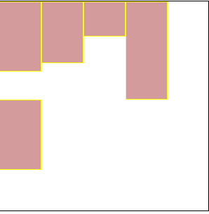
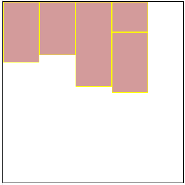
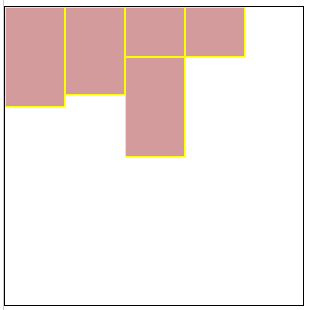

[toc]


# CSS

Cascading  Style  Sheets （层叠样式表）

## 引入

**内部样式**：控制一个页面 （**权重最高**）

```html
<style type="text/css">
/* 样式 */
</style>
```

**行内样式**：控制一个标签

```html
<div style="color:red;"></div>
```

**外部样式**：控制整个站点

```html
<!-- 1.使用标签关联 -->
<head>
    <link rel="stylesheet" type="text/css" href="css文件路径">
</head>
<!-- 2.使用指令关联 -->
<style type="text/css">
    @import url("css文件路径")
</style>
```

**优先级**：行内 > 外部样式 > 默认样式

## css基础属性

### 字体属性

- **字体大小** - `font-size`：数字 + 像素单位(px)
- **字体粗细** - `font-weight`
  - `normal`：正常（400）
  - `bold`：加粗（700）
  - `bolder`：(900)
- **字体风格** - `font-style`
  - `normal`：正常（默认）
  - `italic`：倾斜
- **字体类型** - `font-family`：宋体，微软雅黑，黑体等
  - 多组用**逗号**隔开
  - 空格 # $ 特殊字符 中文，需要**添加引号**

```css
/* font: font-style  font-weight  font-size/line-height  font-family */
font:italic bolder 30px/100px "微软雅黑";
```

>`font-size`和`font-family`**必写**，其余选写

### 文本属性

**文本修饰** - `text-decoration`

- `underline`：下划线
- `overline`：上划线
- `line-through`：删除线
- `none`：无

**文本转换** - `text-transform`

- `uppercase`：转大写
- `lowercase`：转小写
- `capitalize`：首字母大写

**文本对齐方式** - `text-align`

- `left`：左对齐**（默认）**
- `center`：居中对齐
- `right`：右对齐

**首行缩进** - `text-indent`

- 取值：px或em

### css尺寸和行高

#### 尺寸

**宽度**：`width`：值

**高度**：`height`：值

- 单位 px 或 em

> **div不设高度，默认为0**

#### 行高

文字与文字之间的上下距离 `line-height`：值

*行高   =  上距离 +  内容高度  + 下距离* 

*TIPS* **标签文字垂直居中**，标签的高度和行高


### 背景属性 

`background-color`

- 有效的颜色名称 - 比如 `red`
- 十六进制值 - 比如 `#ff0000`
- RGB 值 - 比如 `rgb(255,0,0)`

>  `opacity` 属性为背景添加透明度，所有*子元素都继承*相同的透明度

**背景颜色**：`background-color`：颜色值

**背景图片**：`background-image`：url(图片路径)

**背景图片平铺**：`background-repeat`：值

- `no-repeat`：不平铺
- `repeat-x`：横向平铺
- `repeat-y`：纵向平铺

> 默认横纵都平铺

**背景图片位置**：`background-position`:水平位置，垂直位置

- `top left bottom right center`
- `x y`（单位px）

只有一个值为`center`，水平垂直为`center`

只有一个值为`top left bottom right`，另一个方向默认为`center`

**背景缩放**：`background-size`:宽度 高度

- 单位 ：长度 / 百分比 / 特殊值
- 特殊值
  - `cover` - 背景扩展足够大，**完全覆盖**
  - `contain` - 扩展为最大尺寸，**高度或宽度适应**

> 只写一个参数，参数为高度

*TIPS***背景图填充**：center top

```css
html,body {height: 100%;}
body {
     background: url(img/vivo-bg.jpg) no-repeat center top;
     background-size: cover;
}      
```

**背景受滚动条的影响**`background-attachment`：值

- `scroll`：当内容滚动到下方，图片会消失（**默认**）
- `fixed`：图片一直保持在视线范围内
- `inherit`：从父级继承

**图片定位参考**：`background-origin`

- `padding-box`：相对内边距定位
- `border-box`：相对边框定位
- `content-box`：相对内容框定位

**背景的绘制区域**：`background-clip`

- `padding-box`：裁剪到内边距框
- `border-box`：裁剪到边框
- `content-box`：裁剪到内容框

**背景透明**：`background:rgba()` ，取值 0-1 

**background简写**

```css
/* background: 背景颜色 背景图片地址 背景平铺 背景滚动 背景位置 背景大小; */
background: transparent url(image.jpg) repeat-y  scroll center top ;
```

***`img` 和 `backgroud-image`区别***

**img**

- 图片**能撑开**盒子
- 移动位置用 padding margin

**backgroud-image**

- **撑不开**容器的 需要专门写宽高
- 移动位置 background-position

### 列表属性

**列表前缀样式**：`list-style-type:none`

**列表前缀自定义图片**：`list-style-image:url(图片路径)`

> ul去掉自定义样式

```css
ul{
    list-style:none;
    padding:0;
    margin:0;
}
```

## css选择器

### 基本选择器

|            |    基本选择器     |   例子   |                  |
| :--------: | :---------------: | :------: | ---------------- |
| 元素选择器 |     `element`     |   p{}    |                  |
|  id选择器  |       `#id`       |  #id{}   |                  |
|  类选择器  |     `.class`      | .class{} |                  |
| 分组选择器 | `element,element` |  div, p  | 选中多个元素     |
| 通配选择器 |        `*`        |    *     | 选择**所有**元素 |

> id选择器：用于选择唯一元素（元素id唯一）

### 常用选择器

|   常用选择器   |       选择器        | 说明               | 例子    |                                        |
| :------------: | :-----------------: | ------------------ | ------- | -------------------------------------- |
|   后代选择器   |  `element element`  | 选择**所有**子元素 | div p   | <div> 元素内的所有 <p> 元素            |
|  子元素选择器  | `element > element` | 选择**直接**子元素 | div > p | 父元素是 <div> 的**所有** <p> 元素     |
| 相邻元素选择器 | `element + element` | 选择**相邻**元素   | div + p | **紧跟** <div> 元素的**首个** <p> 元素 |
|   兄弟选择器   | `element ~ element` | 选择**兄弟**元素   | p ~ ul  | **前面**有<p>的**每个**<ul>元素        |

### 属性选择器

|      属性选择器      | 说明                             |         例子         |
| :------------------: | -------------------------------- | :------------------: |
|    `[attribute]`     | 带有**指定属性**的元素           |       [target]       |
| `[attribute=value]`  | 带有**指定属性并且值相同**的元素 |   [target=_blank]    |
| `[attribute~=value]` | **包含**指定词汇的元素           |   [title~=flower]    |
| `[attribute|=value]` | 选取属性值**以指定值开头**的元素 |     [lang\|=en]      |
| `[attribute^=value]` | 以**指定值开头**的元素           |   a[href^="https"]   |
| `[attribute$=value]` | 以**指定值结尾**的元素           |   a[href$=".pdf"]    |
| `[attribute*=value]` | **包含指定值**的元素             | a[href*="w3schools"] |
| `[attribute$=value]` | 以**指定值结尾**的每个元素       |  div[class$="test"]  |

`[attribute~=value]` ：**值为整个单词**

*有效*：`test` `second`
*无效*：`tes`

```html
<div class="first_test">第一个 div 元素。</div>
<div class="second">第二个 div 元素。</div>
<div class="test">第三个 div 元素。</div>
```

`[attribute | =value]`：**该值必须是整个单词，或者后面跟着连字符**

*有效*：`top`、`content`
*无效*：`to` `top-` `header` `con` 

```html
<h1 class="top-header">Welcome</h1>
<p class="content">Are you learning CSS?</p>
```


> `[attribute*=value]` 包含固定字符即可
>
> `[attribute^=value]` 固定字符开头即可

### [伪类](https://developer.mozilla.org/zh-CN/docs/Web/CSS/Pseudo-classes)

伪类用于定义**元素的特殊状态**

| 伪类       | 说明                            |
| ---------- | ------------------------------- |
| `:link`    | 链接默认状态                    |
| `:visited` | 点击后状态                      |
| `:hover`   | 鼠标悬停状态                    |
| `:active`  | 鼠标按下状态                    |
| `:focus`   | 选取获得焦点的元素 （表单元素） |

`visited`和`link`不能适用于普通标签，只有a标签才有

> 考虑CSS权重问题，将一般的放在上面，将特殊的放在下面，focus在hover和 active之间
>
> 按照`lv f ha`顺序 - love hate

**其他伪类**

| 伪类                   | 例子                      | 说明                                                   |
| ---------------------- | ------------------------- | ------------------------------------------------------ |
| `:root`                | root                      | 选择元素的**根元素**                                   |
| `:not(selector)`       | :not(p)                   | 选择每个**非 `<p>` 元素**的元素                        |
| `:empty`               | p:empty                   | 选择**没有子元素**的每个 <p> 元素                      |
|                        |                           |                                                        |
| `:first-child`         | p:first-child             | 父节点下第一个元素且为<p>元素                          |
| `:first-of-type`       | p:first-of-type           | 父节点下第一个 <p>元素                                 |
| `:nth-child(n)`        | p:nth-child(2)            | 父节点下第二个元素且为<p>标签                          |
| `:nth-of-type(n)`      | p:nth-of-type(2)          | 父节点下第二个 <p>元素                                 |
| `:last-child`          | p:last-child              | 与first类似，从后往前                                  |
| `:last-of-type`        | p:last-of-type            | 与first类似，从后往前                                  |
| `:nth-last-child(n)`   | p:nth-last-child(2)       | 与first类似，从后往前                                  |
| `:nth-last-of-type(n)` | p:nth-last-of-type(2)     | 父节点下倒数第二个<p>元素                              |
| `:only-child`          | p:only-child              | 父节点仅有一个元素且为<p>元素，支持嵌套                |
| `:only-of-type`        | p:only-of-type            | 父节点下唯一<p>元素，支持嵌套                          |
| **input**              |                           |                                                        |
| `:checked`             | input:checked             | **被选中** <input> 元素                                |
| `:disabled`            | input:disabled            | **被禁用** <input> 元素                                |
| `:enabled`             | input:enabled             | **已启用**<input> 元素（默认）                         |
| `:in-range`            | input:in-range            | 值在**范围内**的<input>元素                            |
| `:out-of-range`        | input:out-of-range        | 值在**范围外**的<input>元素                            |
| `:invalid`             | input:invalid             | **具有无效值**的 <input> 元素                          |
| `:valid`               | input:valid               | **具有有效值**的 <input> 元素                          |
| `:read-only`           | input:read-only           | **带 "readonly"**  <input> 元素                        |
| `:read-write`          | input:read-write          | **不带 "readonly"**  <input> 元素                      |
| `:required`            | input:required            | **带 "required"** <input> 元素                         |
| `:optional`            | input:optional            | **不带 "required"** <input> 元素                       |
|                        |                           |                                                        |
| **other**              |                           |                                                        |
| `:lang(language)`      | p:lang(it)                | lang属性以`it`开头的元素（eg：lang=“it” lang=“it-ha”） |
| `:target`              | p:target<br />#new:target | 选择瞄点定位后的<p>元素<br />herf=“#new”锚点定位后元素 |

**nth-child扩展**

- 2n - 偶数
- 2n+1 - 奇数
- 5n - 5 10 15
- n+5 - 从第5个开始
- -n+5 - 前5个
- **n从0开始，但是大于0才有效**

### [伪元素](https://developer.mozilla.org/zh-CN/docs/Web/CSS/Pseudo-elements)

CSS 伪元素用于设置**元素指定部分的样式**

一个选择器中只能使用一个伪元素。伪元素必须紧跟在语句中的简单选择器/基础选择器之后

| 伪元素           | 例子                   | 说明                                     |
| ---------------- | ---------------------- | ---------------------------------------- |
| `::after`        | p::after               | <p> 元素**之后**插入内容                 |
| `::before`       | p::before              | <p> 元素**之前**插入内容                 |
| `::first-letter` | p::first-letter        | 每个 <p> 元素的**首字母**                |
| `::first-line`   | p::first-line          | 每个 <p> 元素的**首行**                  |
| `::placeholder`  | input::placehold**er** | **带 "placeholder"** 属性的 <input> 元素 |
| `::selection`    | p::selection           | 选择用户**选择的元素部分**               |

> `::first-letter` `::first-line` 只适用于块级

## css特性

### 样式的继承和覆盖

**覆盖**（层叠）：相同样式，后面覆盖前面。

> 选择器相同，后面覆盖前面。选择器不同，看优先级。

**继承**：父标签设置了样式，子标签都会具有父标签的样式

- **font-，text-，color，line- 能继承**
- **div不能继承高度，可以继承宽度**
- 子标签和父标签设置相同css，会覆盖父标签样式

### 样式优先级 

​	**样式分类**：`行内样式>内部=外部`，内部样式和外部样式权重主要看顺序。

​	**样式优先级**：`伪类首字>伪类首行>!important>id名>类名=属性>标签名>通配`

​	**样式叠加**：`!important(无穷大) 行内样式(1000) id(100) class(10) 标签(1)`

> 每一级满10也不会往前进1   10 class权重小于1 id

### 修改样式三步走

- 看标签是否选中
  - 选中，计算权重，谁大选谁
  - 没选择，权重为0（因为继承权重为0）

> 计算权重：**关键看是不是直接修饰的目标标签**

## 标签显示模式

### 块元素

- 宽度：100%（默认），会继承父级宽度
- 高度：0（默认）
- 换行显示，宽高均可设置

```
div、h1-h6、p、pre、ul、ol、li、form、table
```

**p标签不能放任何块级元素**，但可以存放含 `display:block` 元素

```html
<p><p></p></p>
<!-- 上面结构会自动转为下面结构 -->
<p></p>
<p></p>
```

h1-h6、dt里面不能放其他块级元素

### 行元素

- 宽度：内容宽度（默认）
- 高度：0（默认）
- 一行显示，**不能设置宽高**

```
a、strong、b、em、i、del、s、ins、u、span、label、img
```

### 行内块元素

- 宽度：内容宽度（默认）
- 高度：0（默认）
- 单行显示，能设置宽高

默认**宽度为内容宽度**，能设置宽和高，不能换行显示

```
img、input、td
```

### display

`display:值`

- **block**：块元素
- **inline**：行元素
- **inline-block**：行内块元素
- **none**：隐藏元素 （不占空间）

> 浮动后元素特性：类似 inline-block。（浮动脱标，inline-block不脱标）

## 盒子模型

### padding - 内边距

padding值**会增加盒子宽或高**

- 1值-上下左右
- 2值-上下  左右
- 3值-上 左右 下
- 4值-上 右 下 左 （顺时针）

**默认撑开盒子，但是如果没有宽度或继承的宽度，padding不会撑开盒子**

```html
<div>
  <p></p>
</div>
```

```css
div {
  width: 300px;
  height: 100px;
  background-color: purple;
}
div p {
  /* width: 100%;*/
  padding: 30px;
  background-color: skyblue;
}
```

注释width：100%，宽度等于父级宽度

解开width：100%，宽度等于父级宽度+60px

### margin - 内边距

**块级盒子居中**

- 有宽度，左右为auto 
- 无宽度，默认为100%，不存在居中

```css
/*写法1*/
margin:0 auto;
/*写法2*/
margin:auto;
/*写法3*/
margin-left:auto; /*左侧充满*/
margin-right:auto; /*右侧充满*/
/* 根据剩余长度居中对齐 */
```


> **行内元素尽量只设置 左右边距**

### 边框属性

边框会增加盒子宽高

**边框类型**：`border-style`

- **solid**：实线
- **dashed**：虚线
- **dotted**：点线
- **double**：双线

**边框颜色**：`border-color`

**边框厚度**：`border-width`

**简写**：`border:宽度 类型 颜色` 

**边框圆角**：`border-radius:值`

- 左上角 右上角  右下角  左下角 (顺时针)
- border-top、border-right、border-bottom、border-left

**去边框**：`border：none`

**细线表格**：`border-collapse:collapse;`

- 合并相邻边框
- 表格和单元格都加边框属性

> 块级盒子没有width（包含继承），添加padding和border不会撑大盒子

### 盒子模型的bug

**1.盒子上下摆放，上盒子有下外边距，下盒子有上外边距，两个边距会重合，以大的边距为准**


**解决**：间距给到一个元素上


**2.两个盒子嵌套关系，两个盒子对于上外边距会重合，以大的边距为准**


**解决**：

- 外部盒子：添加**border-top**
- 外部盒子：添加**padding-top**
- 外部盒子：添加**oveflow:hidden**

### 盒子模型布局稳定性

**width > padding > margin**

- width：需手动计算
- padding：盒子撑大
- margin：垂直外边距合并

### margin负值

**水平垂直居中**：负边距+定位

```css
.inner-box {
  width: 100px;
  height: 100px;
  background-color: #666;
  position: absolute;
  top: 50%;
  left: 50%;
  margin-left: -50px;
  margin-top: -50px;
}
```

> 很少使用，通常  `transform:translate(-50%,-50%)`

**压住盒子相邻边**

场景：由于设置`border`，4个盒子总宽度 (200+2)\*4，所以末尾盒子背挤向下一排

解决：设置 `margin-left:-2px`

原理：第1个item向前移动2px，第2个item由于浮动先贴紧，然后再向左移动2px，以此类推，第4个item，在原来基础上向左移动8px。

```css
.list {
  margin-top: 20px;
  margin-left: 20px;
  box-sizing: content-box;
  width: 800px;
  height: 500px;
  background-color: #888;
}
.item {
  box-sizing: content-box;
  margin-left: -2px;
  float: left;
  border: 1px solid #ccc;
  width: 200px;
  height: 200px;
  background-color: #999;
}
.item:hover {
  position: relative;
  border-color: tomato;
}
```

## 布局

标准流（底层）- 浮动流（中间）- 定位（顶层）

> 海底 - 地面 - 天空

### **标准流**

按照标签默认的特性摆放盒子

- 块级元素，从上向下
- 行内元素，从左到右，边缘换行

###  **浮动流**

 `float:left/right/none`

  - 脱离标准流，浮在标准流上面（**不占位置**）
  - 任何元素都可浮动
  - 浮动后生成块级框（类似行内块），**不换行，能设置宽高** 
  - 设置浮动的元素，**居中不起作用**

#### 浮动元素重叠

- 行内元素与浮动元素发生重叠，边框、背景、内容都会显示在浮动元素之上

- 块级元素与浮动元素发生重叠，边框、背景在浮动元素之下，**内容在浮动元素之上**

#### 浮动元素位置

浮动元素换行

大盒子放不下了，浮动元素会掉下去，**随前面元素高度变化**

- 前一个元素 `>` 前两个元素，到第一个元素下方
- 前一个元素 `<` 前两个元素，到前一个元素下方
- 前一个元素 `=` 前两个元素，向前移，比较前二



##### 浮动元素和父盒子

- 参照父盒子对齐
- 不会与边框重叠，也不会超过内边距

##### 浮动元素和兄弟盒子

- 前一个盒子浮动，当前盒子和前一个**顶部对齐**
- 前一个盒子标准流
  - 行元素，浮动元素显示在前面
  - 块元素，浮动元素显示在下面

> 浮动只**会影响当前或者后面标准流盒子**，不会影响前面

**应用**

- 盒子水平排列
- 盒子左右对齐
- 文字环绕图片

> 盒子水平排列：可以用inline-block，但盒子间空隙不方便处理

#### 浮动问题

**浮动在父盒子不占位置，无法撑开父盒子**（高度为0），影响之后元素


#### 清除浮动

**清除浮动脱标的影响**（对之后元素）

1. 父元素设置高度 (不推荐，高度一般可变)
2. **额外标签法(隔墙法)**：在浮动元素末尾添加一个空的标签

```css
<div class='clear'></div>
.clear{clear: both;}
```

> 添加无意义标签，结构化差

3. **父级添加overflow属性** `overflow:auto`

- hidden 溢出全部隐藏
- auto 溢出产生滚动条

缺陷：内容溢出后，会隐藏元素

4. after伪元素(**推荐**)

```css
.clearfix:after { 
     content: "\200B"; 
     display: block; 
     height: 0; 
     clear: both;
     visibility: hidden; 
} 

 .clearfix {*zoom: 1;}   /* IE6、7 专有 */
```

> \200B - 零宽度空格，也可用 `.` ，可以不写
>
> block - 块级显示，宽度填充
>
> height - 避免破坏原有布局
>
> clear:both - 清除浮动
>
> hidden  - 隐藏元素（占位）

  > *zoom - 由于IE6-7不支持:after，使用 zoom:1触发 hasLayout

5. **使用双伪元素清除浮动(推荐)**

```css
.clearfix:before,.clearfix:after { 
  content:"";
  display:table; 
}

.clearfix:after {
 clear:both;
}
.clearfix {
  *zoom:1;
}
```

  >  table - 创建匿名单元格触发 bfc

### 定位流

**将盒子定位在某一位置**，让多个盒子前后叠压来显示

#### 静态定位

`position:static`

所有标准流都是静态定位

应用：将定位后元素还原成标准流

#### 相对定位

`position：relative`

**相对于自身标准流的位置**进行定位	

- 出发点：**自身标准流**的位置
- 自身在标准流中**还占有空间**
- **可以盖在标准流的上方**


#### 绝对定位

`position:absolute`

**脱离标准流**进行定位

- **偏移参考**：设置过定位[^1]的**直系父元素或直系祖先**。一直未找到，参考最顶层html

- **会脱离标准流**，不占空间，内容决定宽高，可定义宽高
- `margin：auto` 失效

如果父级（祖先）没有定位则**相对于html**，以下为父级有定位


应用：**父相子绝**

父级相对定位，保证元素占位，子级通过绝对定位，不占位显示

#### 固定定位

**浏览器作为参考进行偏移**，且滚动条对固定定位无效

`position:fixed`

- **会脱离标准流**，不占空间，内容决定宽高，可定义宽高
- `margin：auto`失效
- **不随滚动条滚动**，永远固定在**浏览器窗口**中的位置

### 定位元素层叠效果

`z-index`：控制定位元素的**叠放层级**

- 数字
  - 正数，越大，层级越高 `>auto`
  - 负数，越小，层级越低 `<auto`
- auto（默认）：与父元素同级

> 层级越高，越靠近用户

**特性**：

- z-index只针对**定位**[^1]元素有效果
- **父元素比较过层级**（均有`z-index`值，且不为`auto`），==子元素不会再比较==
- **`auto`比正数小**

### 总结

| 定位模式 | 是否脱标占有位置     | 边偏移 | 移动位置基准                 |
| -------- | -------------------- | ------ | ---------------------------- |
| static   | 不脱标，正常模式     | 不可以 | 正常模式                     |
| relative | 不脱标，占有位置     | 可以   | **相对于自身**位置移动       |
| absolute | 完全脱标，不占有位置 | 可以   | **相对于定位的父级**移动位置 |
| fixed    | 完全脱标，不占有位置 | 可以   | **相对于浏览器**移动位置     |

> 定位[^1]元素不会**触发外边距合并**的问题

# 移动web

## 视口

视口（viewport）：浏览器显示页面内容的**屏幕区域**。 

视口分为布局视口、视觉视口和理想视口

### 布局视口 layout viewport

移动设备的浏览器都**默认**设置了一个布局视口。


### 视觉视口 visual viewport

**用户**正在看到的网站的区域（网站区域）


### 理想视口 ideal viewport

使网站在移动端有最理想的浏览和阅读宽度而设定

**手动添写meta视口标签**

- `width` - viewport宽度
- `user-scalable` -  用户是否可以缩放 `yes` | `no`
- `initial-scale` - **初始**缩放比
- `maximum-scale` - **最大**缩放比
- `minimum-scale` - **最小**缩放比

```html
<meta name="viewport" content="width=device-width，user-scalable=no,initial-scale=l.0,maximum-scale=l.0,minimum-scale=l.0">
```

## 像素

**物理像素**：屏幕显示的最小颗粒，是真实存在

**物理像素比或屏幕像素比**：一个px显示物理像素点个数

## 移动端方案

### 单独制作移动端页面（主流）

网址域名前面加 m(mobile)，PC端和移动端为两套网站

- 流式布局（百分比布局）
- flex 弹性布局（强烈推荐）
- less+rem+媒体查询布局

### 响应式页面兼容移动端（其次）

pc和移动端共用一套网站，不同屏幕下，样式会自动适配

- 媒体查询
- bootstarp

### 移动端兼容问题

移动端浏览器基本以 `webkit` 内核为主

> 移动端 CSS 初始化推荐使用 `normalize.css` 

```css
/*CSS3盒子模型*/
box-sizing: border-box;
-webkit-box-sizing: border-box;
/*点击高亮我们需要清除 设置为transparent 完成透明*/
-webkit-tap-highlight-color: transparent;
/*在移动端浏览器默认的外观在iOS上加上这个属性才能给按钮和输入框自定义样式*/
-webkit-appearance: none;
/*禁用长按页面时的弹出菜单*/
img,a { -webkit-touch-callout: none; }
```

## rem布局

rem(root em)：一个相对单位，类似于em，em是父元素字体大小。**rem基于html元素字体大小**

> 父元素文字大小可能不一致， 但只有一个html

### rem适配方案

使用媒体查询按不同设备设置不同html字体大小，然后以 rem作为尺寸单位

> 原理：利用rem的唯一性和媒体查询

- less+rem+媒体查询

- `flexible.js`+ rem（推荐）
  - 原理：设备划分为10等份
  - 设计稿是 750px， 只需要把 html 文字大小设置为75px(750px / 10) 

**html font-size字体 = 屏幕宽度 / 划分的份数**
**px 对应 rem =  页面元素值（px） /  html font-size字体**

最终公式 ：  **px 对应 rem =  页面元素值（px） /  （屏幕宽度 /  划分的份数）**


## 响应式布局

使用媒体查询针对不同宽度的设备进行布局和样式的设置，从而适配不同设备的目的。

|   设备   |      尺寸       | 版心 |
| :------: | :-------------: | :--: |
| 超小屏幕 |   尺寸 < 768    | 100% |
|   平板   | 768< 尺寸 <992  | 750  |
|  显示器  | 992< 尺寸 <1200 | 970  |
| 大显示器 |   1200 < 尺寸   | 1170 |

### Bootstrap

http://www.bootcss.com/

http://getbootstrap.com/

http://bootstrap.css88.com/

```html
<!DOCTYPE html>
<html lang="zh-CN">
  <head>
    <meta charset="utf-8">
   <!--要求当前网页使用IE浏览器最高版本的内核来渲染-->
	<meta http-equiv="X-UA-Compatible" content="IE=edge">
	<!--视口的设置：视口的宽度和设备一致，默认的缩放比例和PC端一致，用户不能自行缩放-->
	<meta name="viewport" content="width=device-width, initial-scale=1, user-scalable=0">

    <title>Bootstrap 101 Template</title>

    <!-- Bootstrap -->
    <link href="css/bootstrap.min.css" rel="stylesheet">

    <!-- HTML5 shim and Respond.js for IE8 support of HTML5 elements and media queries -->
    <!-- WARNING: Respond.js doesn't work if you view the page via file:// -->
      <!--[if lt IE 9]>
	<!--解决ie9以下浏览器对html5新增标签的不识别，并导致CSS不起作用的问题-->
	<script src="https://oss.maxcdn.com/html5shiv/3.7.2/html5shiv.min.js"></script>
	<!--解决ie9以下浏览器对 css3 Media Query 的不识别 -->
	<script src="https://oss.maxcdn.com/respond/1.4.2/respond.min.js"></script>
	<![endif]-->
  </head>
  <body>
    <h1>你好，世界！</h1>

    <!-- jQuery (necessary for Bootstrap's JavaScript plugins) -->
    <script src="//cdn.bootcss.com/jquery/1.11.3/jquery.min.js"></script>
    <!-- Include all compiled plugins (below), or include individual files as needed -->
    <script src="js/bootstrap.min.js"></script>
  </body>
</html>
```

# 补充

## 背景线性渐变

起始方向： **方位名词 或者 度数** 

 如果省略默认就是 `top`

```css
background: linear-gradient(起始方向, 颜色1, 颜色2, ...);
background: -webkit-linear-gradient(left, red , blue);
background: -webkit-linear-gradient(left top, red , blue);
```

> 背景渐变必须添加浏览器私有前缀

## BFC

BFC(Block formatting context)："块级格式化上下文"。它是一个独立的渲染区域，只有Block-level box参与

哪些情况会产生BFC:

1. 根元素
2. float属性不为none
3. position为absolute或fixed
4. display为inline-block, table-cell, table-caption, flex, inline-flex
5. overflow不为visible

## 光标形状 cursor

`cursor:值`

| 属性值        | 描述                                          |
| ------------- | --------------------------------------------- |
| `default`     | 箭头（默认）                                  |
| `pointer`     | 小手                                          |
| `move`        | 移动                                          |
| `text`        | 文本                                          |
| `not-allowed` | 禁止                                          |
| `help`        | 问号                                          |
| `url()`       | 临时替换样式<br />`cursor:url('*.ico'),auto;` |

## 轮廓线 outline

`outline:值`

```css
 outline : outline-color ||outline-style || outline-width 
```

应用： `outline: 0;`   或者  `outline: none;`

## 元素可见性

`visibility:值` （**占空间**）

- hidden隐藏
- visible可见

`display:none`（**不占空间**）

> 应用：js特效，下拉菜单

`overflow:值`

- **auto**：内容溢出时，生成滚动条（**默认**）
- **hidden**：内容溢出时超出部分隐藏
- **scroll**：右边和下边都有滚动条	
- **visible**（默认）：不剪切内容，也不加滚动条

> 水平方向溢出可以使用overflow-x，纵向溢出使用overflow-y
>
> 应用：清除浮动，保证内容不超出盒子

## 行内文字溢出省略号显示

`white-space`：设置或检索对象内文本显示方式

- **normal** - 默认
- **nowarp** - 一行显示（直到文本结束or br标签）

`text-overflow`：设置或检索是否使用一个省略标记

- **clip**：不显示
- **ellipsis**：溢出省略号显示

### 单行溢出

```css
overflow:hidden;
white-space: nowrap;/* 设置文本不换行，单行显示 */
text-overflow:ellipsis;/* 超出的文本使用省略号代替 */
```

### 多行溢出省略号

```css
display: -webkit-box; /*弹性伸缩盒子模型*/
-webkit-box-orient: vertical; /*伸缩盒子子排列方式*/
-webkit-line-clamp: 3; /*设置显示文本行数*/
text-overflow: ellipsis;
overflow: hidden;
```

## 多栏布局

**分栏显示**：`column-count:值` 

- 值：栏目的数量

**多栏隔断框**：`column-rule:值` 

- 取值同边框

**每一栏的宽度**：`column-width:值`

## 对齐

### 水平居中

|            | margin:0 auto； | text-align:center;   |
| ---------- | --------------- | -------------------- |
| 针对的对象 | 块元素          | 行元素和行内块       |
| 居中的范围 | 盒子本身        | 盒子中的文字和行内块 |

### 垂直居中

只针对**行内元素或行内块元素**

```css
vertical-align : baseline |top |middle |bottom 
```

> 设置在img上

**应用**：图片/表单与文字的对齐


#### 垂直居中补充

##### table

```css
parent {
display: table;
}
child {
display: table-cell;
vertical-align: middle;
}
```

##### 弹性布局

```css
parent {
display: flex;
align-items: center;
}
```

##### 定位

```css
parent {
position: relative;
}
child {
position: absolute;
top: 50%;
transform: translateY(-50%);
}
```

##### 伪元素

```css
parent:after {
content: '';
display: inline-block;
height: 100%;
vertical-align: middle;
width: 0;
}
child {
display: inline-block;
vertical-align: middle;
}
```

### **图片底侧空白缝隙**问题

原因：图片或者表单等行内块元素，他的**底线会和父级盒子的基线对齐**

- 设置图片对齐方式(除了baseline) - `vertical-align:middle | top| bottom`
- 将图片转为块级，**垂直对齐对块级无效** - `display:block` 

## 其他

**去掉文本域自动拉伸**：`resize:none;`

**透明度**：`opacity:值` （ 0 - 1）

**背景透明**：`rgba(值1，值2，值3，值4)`

- 值123：颜色（0-255）
- 值4：透明度

**缩放ZOOM**：`zoom:值`

- 倍数（整数，小数）

**zoom和transform区别**

`zoom：2`

默认以左上角，占位


`transform:scale(2);`

默认以中心点，不占位


# 引用

[^1]: 相对/绝对/固定

