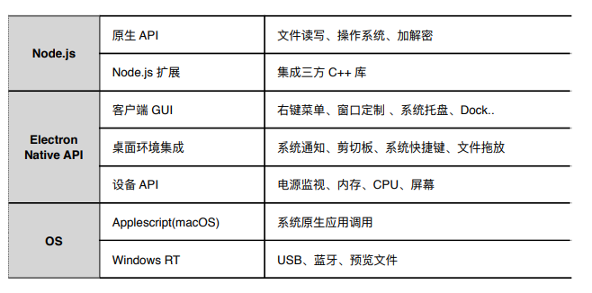
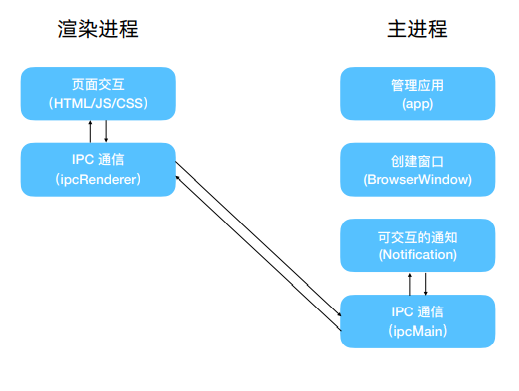

# Electron

Electron是一个使用 JavaScript、HTML 和 CSS 构建**桌面应用程序的框架**。

嵌入 [Chromium](https://www.chromium.org/) 和 [Node.js](https://nodejs.org/) 到 二进制的 Electron 允许您保持一个 JavaScript 代码代码库并创建 在Windows上运行的**跨平台**应用 macOS和Linux

> Electron 将 Node.js 嵌入到其二进制文件中，你应用运行时的 Node.js 版本与你系统中运行的 Node.js 版本无关



## 入门

### 应用程序创建

1. 新建文件夹，初始化项目

```shell
mkdir my-electron-app && cd my-electron-app
yarn init
```

2. 将 `electron` 添加开发依赖

```shell
yarn add --dev electron
```

3. `package.json` 新加 命令

```json
{
  "scripts": {
    "start": "electron ."
  }
}
```

4. main.js - 添加主进程

主进程： Electron 应用程序的入口 `main` 文件。

> package.json 中 main 字段，可配置应用程序入口

5. index.html - 创建页面

为应用创建窗口前，需要先创建加载进该窗口的内容。 在 Electron 中，每个窗口中**无论是本地的HTML文件还是远程URL都可以被加载显示。**

```html
<!DOCTYPE html>
<html>
  <head>
    <meta charset="UTF-8">
    <!-- https://developer.mozilla.org/en-US/docs/Web/HTTP/CSP -->
    <meta http-equiv="Content-Security-Policy" content="default-src 'self'; script-src 'self'">
    <meta http-equiv="X-Content-Security-Policy" content="default-src 'self'; script-src 'self'">
    <title>Hello World!</title>
  </head>
  <body>
    <h1>Hello World!</h1>
    We are using Node.js <span id="node-version"></span>,
    Chromium <span id="chrome-version"></span>,
    and Electron <span id="electron-version"></span>.
  </body>
</html>
```

6. 打开页面 - main.js中添加

将页面加入应用窗口，需要 2个 Electron 模块

- [`app`](https://www.electronjs.org/zh/docs/latest/api/app) ：控制应用程序的事件**生命周期**
- [`BrowserWindow`](https://www.electronjs.org/zh/docs/latest/api/browser-window) ：它**创建和管理应用**程序窗口

 `app` 模块的 [`ready`](https://www.electronjs.org/zh/docs/latest/api/app#event-ready) 事件被激发后才能创建浏览器窗口，使用 [`app.whenReady()`](https://www.electronjs.org/zh/docs/latest/api/app#appwhenready) API来监听此事件。

```js
const { app, BrowserWindow } = require('electron')
// 将 index.html 加载进 BrowserWindow 实例
function createWindow () {
  const win = new BrowserWindow({
    width: 800,
    height: 600
  })
  win.loadFile('index.html')
}

// whenReady 成功后，调用 createWindow
app.whenReady().then(() => {
  createWindow()
})
```

### 生命周期

使用 `进程` 全局的 [`platform`](https://nodejs.org/api/process.html#process_process_platform) 属性来专门为某些操作系统运行代码

`Windows和Linux`：关闭所有窗口通常会**完全退出**一个应用程序。

```js
app.on('window-all-closed', function () {
  // 平台不为mac 退出程序
  if (process.platform !== 'darwin') app.quit()
})
```

`macOS`：应用通常即使在**没有打开任**何窗口的情况下**也继续运行**

```js
app.whenReady().then(() => {
  createWindow()
  // 应用初始化后，新建窗口
  app.on('activate', function () {
    if (BrowserWindow.getAllWindows().length === 0) createWindow()
  })
})
```

### 预加载脚本 - 从渲染器访问 node.js

不能在主进程编辑DOM，因为无法访问渲染器 文档上下文。 **它们存在于完全不同的进程！**

预加载脚本：渲染器进程加载之前加载。

**有权访问两个 渲染器全局 (例如 `window` 和 `document`) 和 Node.js 环境**。

`preload.js`

```js
window.addEventListener('DOMContentLoaded', () => {
  const replaceText = (selector, text) => {
    const element = document.getElementById(selector)
    if (element) element.innerText = text
  }

  for (const dependency of ['chrome', 'node', 'electron']) {
    replaceText(`${dependency}-version`, process.versions[dependency])
  }
})
```

在主进程中，预加载脚本通过 `webPreferences.preload` 选项配置

```js
const path = require('path')
function createWindow () {
  const win = new BrowserWindow({
    width: 800,
    height: 600,
    webPreferences: {
      // 添加 preload.js
      preload: path.join(__dirname, 'preload.js')
    }
  })
  win.loadFile('index.html')
}

```

### 额外 - 添加功能到网页

在 `index.html` 文件关闭 `</body>` 标签之前添加一个 `<script>` 标签

```js
<script src="./renderer.js"></script>
```

### 打包

将 Electron Forge 添加到您应用的开发依赖中，并使用其"import"命令设置 Forge 的脚手架

```shell
cd my-app
yarn add --dev @electron-forge/cli
yarn electron-forge import
```

使用 Forge 的 `make` 命令来创建可分发的应用程序：

```shell
yarn run make
```

> 目标目录 ： `/out`

## 流程模型

**为什么不是一个单一的进程**：网页浏览器是个极其复杂的应用程序。

- 单个进程来处理所有功能，打开每个标签页的开销较少。
- 但**一个网站的崩溃或无响应会影响到整个浏览器**。

**多进程模型**：单点故障或恶意代码对整个程序的影响

**两种类型进程**：主进程和渲染器



### 主进程

每个 Electron 应用都有一个单一的主进程，作为应用程序的入口点。主进程在 Node.js 环境中运行，这意味着它**具有 `require` 模块和使用所有 Node.js API 的能力**。

#### 窗口管理

通过 [`BrowserWindow`](https://www.electronjs.org/zh/docs/latest/api/browser-window) 模块**创建和管理应用程序**窗口。

`BrowserWindow` 类的每个实例创建一个应用程序窗口，且在单独的渲染器进程中加载一个网页。 您可从主进程用 window 的 [`webContent`](https://www.electronjs.org/zh/docs/latest/api/web-contents) 对象与网页内容进行交互。

```js
const { BrowserWindow } = require('electron')

const win = new BrowserWindow({ width: 800, height: 1500 })
win.loadURL('https://github.com')

const contents = win.webContents
console.log(contents)
```

- `BrowserWindow` 模块是一个 [`EventEmitter`](https://nodejs.org/api/events.html#events_class_eventemitter)， 可以监听事件
- `BrowserWindow` 实例被销毁时，与其相应的渲染进程也会被终止

#### 应用程序生命周期

通过 [`app`](https://www.electronjs.org/zh/docs/latest/api/app) 模块来控制您应用程序的生命周期

```js
// quitting the app when no windows are open on non-macOS platforms
app.on('window-all-closed', function () {
  if (process.platform !== 'darwin') app.quit()
})
```

### 渲染进程

**展示页面的进程**

为每个打开的 `BrowserWindow` ( 与每个网页嵌入 ) 生成一个**单独的渲染器进程**

-  HTML 文件作为渲染器进程的入口点
- 层叠样式表 (Cascading Style Sheets, CSS) 对 UI 添加样式.
-  `<script>` 元素可添加可执行的 JavaScript 代码

**渲染器无法直接访问 `require` 或其他 Node.js API**

==为了在渲染器中直接包含 NPM 模块，您必须使用与在 web 开发時相同的打包工具 (例如 `webpack` 或 `parcel`)==

### 预加载脚本

**预加载（preload）脚本**：包含了那些**执行于渲染器进程中**，且**先于网页内容开始加载的代码**。

- 执行于渲染器进程中，且**先于网页内容开始加载的代码**
- 运行于渲染器的环境中，**能访问 Node.js API** 
- 在 `BrowserWindow` 构造方法中的 `webPreferences` 选项，将预处理脚本添加到主进程

```js
const { BrowserWindow } = require('electron')
//...
const win = new BrowserWindow({
  webPreferences: {
    preload: 'path/to/preload.js'
  }
})
//...
```

预加载脚本与其所附加的渲染器在**全局共享着一个 `window` 变数**，但您并**不能从中直接附加任何变数到 `window`** 之中，因为 [`contextIsolation`](https://www.electronjs.org/zh/docs/latest/tutorial/context-isolation) 是默认的

```js
// preload.js
window.myAPI = {
  desktop: true
}
// renderer.js
console.log(window.myAPI) // => undefined
```

> **语境隔离（Context Isolation）**：预加载脚本与渲染器的主要运行环境是隔离开来的，以避免泄漏任何具特权的 API 到您的网页内容代码中

通过  [`contextBridge`](https://www.electronjs.org/zh/docs/latest/api/context-bridge) 模块来安全地实现交互

- 暴露 [`ipcRenderer`](https://www.electronjs.org/zh/docs/latest/api/ipc-renderer) 帮手模块于渲染器中，使用 进程间通讯 ( inter-process communication, IPC ) 来从渲染器触发主进程任务 ( 反之亦然 )。
- 如果您正在为远程 URL 上托管的现有 web 应用开发 Electron 封裝，则您可在渲染器的 `window` 全局变量上添加自定义的属性，好在 web 客户端用上仅适用于桌面应用的设计逻辑 。

```js
// preload.js
const { contextBridge } = require('electron')
contextBridge.exposeInMainWorld('myAPI', {
  desktop: true
})

// renderer.js
console.log(window.myAPI)
// => { desktop: true }
```


## 进程间通信

### 渲染进程 到 主进程

#### callback 写法

渲染进程发送：`ipcRenderer.send`

主进程监听：`ipcMain.on`

#### Promise 写法 ^7.0+^ 

处理请求 + 响应模式

渲染进程发送：`ipcRenderer.invoke`

主进程处理：`ipcMain.handle`

### 主进程 到 渲染进程

渲染进程监听：`ipcRenderer.on`

主进程发送：`webContents.send` 

### 渲染进程之间

1. 通知事件

- 主进程转发 ^<5.0^
- `ipcRenderer.sendTo`  ^5.0+^

2. 数据共享

- Web 技术（localStorage、sessionStorage、indexedDB）
- 使用 remote

> 少用remote，sync 方法，影响性能

### 主进程之间

主进程只有一个，只是内容过多，分文件

- `webContents.send` ，发送给渲染进程
- 渲染进程
  - `ipcRenderer.on`：接收事件
  - `ipcRenderer.send`：返回事件
