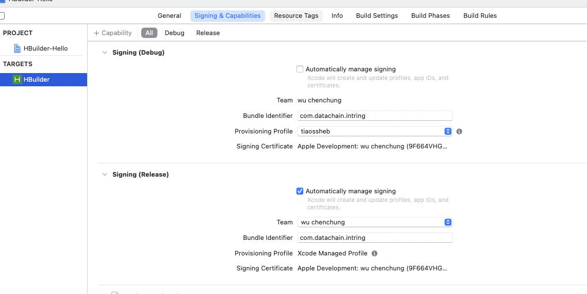

# uniapp 原生打包

### 方式一：新建工程（不推荐）

### 方式二：导入工程

#### 下载 [离线 sdk](https://nativesupport.dcloud.net.cn/AppDocs/download/android)

```bash
HBuilder-Hello               # App离线打包演示应用
HBuilder-Integrate-AS        # 集成uni-app的最简示例
SDK                          # SDK库文件目录
Feature-Android.xls          # Android平台各扩展Feature API对应的详细配置
Readme.txt                   # 版本说明文件及注意事项
UniPlugin-Hello-AS           # uni原生插件开发示例
```

#### 配置工程

1. 基础库配置，引入基础库到 `libs`

> **注意：更新SDK时需要同时更新aar/jar文件和build.gradle配置**

2. 应用配置

- 配置 appkey

在 `Androidmanifest.xml`下 ，新建 `meta-data`节点

```xml
<application
  ...>
  <meta-data
      android:name="dcloud_appkey"
      android:value="替换为自己申请的Appkey" />
```

- 配置应用版本号

`versionCode`：版本号，用于版本升级

`versionName`：版本名称

`applicationId`：应用包名，一般为反向域名

> 建议将`targetSdkVersion`设置为25或以上
>
> **注意：如果需要集成的第三方sdk存在so库文件，只需添加armeabi-v7a、arm64-v8a、x86三个文件夹即可，否则会导致在部分手机上无法运行。**

- 配置应用名称

`app-> src -> main -> res -> values -> strings.xml`目录下，修改 `app_name`，建议 同 `manifest.json`中`name`

- 配置应用启动页及provider节点

> **注意：新建的项目默认会有一个MainActivity的节点，必须删掉！**
>
> **注意：${apk.applicationId} 必须替换成当前应用的包名**

如果集成离线SDK时需要重写application，必须继承自DCloudApplication，否则会导致SDK中业务逻辑无法正常运行。

将对应的application配置到Androidmanifest.xml中（如下），并添加`tools:replace="android:name"`以防出现冲突。

```xml
  <application  
      android:name="io.dcloud.test.TestApplication"  
      android:icon="@drawable/icon"  
      android:label="@string/app_name"  
      tools:replace="android:name">
  </application>
```

- 图标和启动页

icon.png：应用图标。

push.png：推送图标。

splash.png：应用启动页。

3. 资源配置

Android studio默认项目**没有assets文件夹**，**需手动创建**，创建位置**与java目录同级**。

- 创建data文件夹并拷贝资源

将SDK->assets->data文件夹拷贝到刚刚创建的assets文件夹下

> **注意：SDK升级时，data下资源需要同时更新**。

- 创建apps文件夹并拷贝资源

将HBuilderX中的项目导出，将导出的资源复制到assets->apps下

[导出app资源](https://nativesupport.dcloud.net.cn/AppDocs/importfeproject/export)

- 修改`dcloud_control.xml`文件

`dcloud_control.xml`中`appid`、`manifest.json`中的`id` 与 **文件夹名一致**

> 生成自定义基座，需要在根节点下添加`debug="true"`和`syncDebug="true"`
>
> **自定义基座支持热更新需要将`debug-server-release.aar`打入apk中**

# IOS 开发和生产证书申请

## 申请App ID

选择页面中 **'identifiers'**

- `App IDS -> iOS,tvOS,watchOS -> Explict(bundle ID)` 
  
  > bundle ID - com.datachain.kw

## 生成证书请求文件

macOS下，打开**钥匙串访问**

- `钥匙串访问 -> 证书助理 -> 从证书颁发机构请求证书...`

> 请求文件：`.certSigningRequest`

## 开发流程

### 申请development证书

选择页面中 **'Certificates'** 

- `ios App Development -> choose file -> download (ios_development.cer)` 

- 双击 ios_development.cer , 找到证书 , 导出.p12文件 , 输入密码
  
  > 选择文件为 证书请求文件
  > 
  > 开发证书：`.p12`

### 添加调试设备

选择页面中 **'Devices'**

* `填写设备 UDID（设备标识）`
  * 获取设备UDID：设备连接到电脑，启动 iTunes，点击此区域可切换显示设备的 UDID

> 开发描述文件必须绑定调试设备，只有授权的设备才可以直接安装 App

### 申请development描述文件

选择页面中 **'Profiles'**

- `"iOS App Development" -> 选择App ID -> 绑定证书 -> 输入描述文件名称 -> 下载描述文件 `

> 描述文件：  `.mobileprovision`

## 发布流程

与开发流程大致相同，主要区别如下

- 申请证书：`"iOS App Development"`和 `"App Store and Ad Hoc"`
- 发布流程无需添加调试设备
- 申请描述文件：`"iOS App Development"`和`"App Store"`

### 申请production证书

选择页面中 **'Certificates'** 

- `"App Store and Ad Hoc" -> choose file -> download (ios_production.cer)` 
- 双击 ios_production.cer , 找到证书 , 导出.p12文件 , 输入密码

### 申请Distribution描述文件

选择页面中 **'Profiles'**

- `"App Store" -> 选择App ID -> 绑定证书 -> 输入描述文件名称 -> 下载描述文件 `

> 描述文件：  `.mobileprovision`

# IOS 开发生产模式配置




# IOS 相机相册权限配置

官方demo：[IOS集成相册](https://nativesupport.dcloud.net.cn/UniMPDocs/UseModule/ios/ios?id=下面以-gallery-模块为例)

```bash
# 用户相册权限
Privacy - Photo Library Usage Description
# 保存图片至相册
Privacy - Photo Library Additions Usage Description
```
