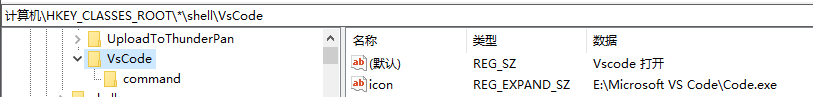
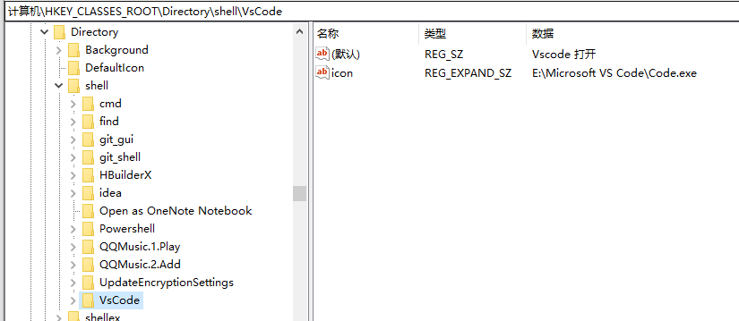
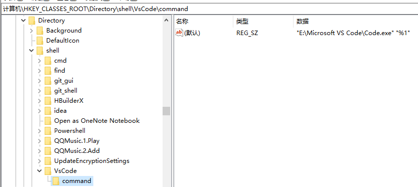
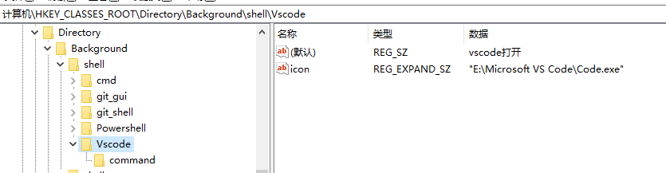
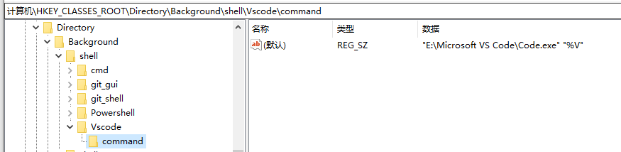

# window

## 右键打开

### 打开文件

`\HKEY_CLASSES_ROOT\*\shell`

1,    `Win+R` 打开运行，输入`regedit`，打开`注册表`，找到`HKEY_CLASSES_ROOT\*\shell`分支，如果没有shell分支，则在`*`下点击右键，选择“`新建`－`项`”，建立shell分支。

2,    在shell下新建“`VisualCode`”项，在右侧窗口的“**默认**”双击，在数据里输入“`用VSCode打开`”。~~这是右键上显示的文字~~

3,    在“`VisualCode`”下再新建`Command`项，在右侧窗口的“**默认**”键值栏内输入程序所在的安装路径，我的是：`"D:\anzhuang\Microsoft VS Code\Code.exe" "%1"`。**其中的%1表示要打开的文件参数**。

4,    配置缩略图。在`VisualCode`项上新建`可扩充字符串值`，命名为`Icon`，双击，把`"D:\anzhuang\Microsoft VS Code\Code.exe"`放进数据就可以了。

### 打开文件夹

`HKEY_CLASSES_ROOT\Directory\shell`

1,    `Win+R` 打开运行，输入`regedit`，打开`注册表`，找到`HKEY_CLASSES_ROOT\Directory\shell`分支

2,  同上面的2一样，数据内的值为“`用VSCode打开文件夹`”

3、4、5、步骤完全一样，不再重复说明了。

### 右键空白，打开文件

`HKEY_CLASSES_ROOT\Directory\Background\shell\`

1. `Win+R` 打开运行，输入`regedit`，打开`注册表`，找到`HKEY_CLASSES_ROOT\Directory\Background\shell\`分支

2、同上面的2完全一样

3、同上，把 `%1` 改为`%V`，例如：`"D:\anzhuang\Microsoft VS Code\Code.exe" "%V"`

4、5同上，完全一样

