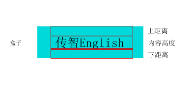
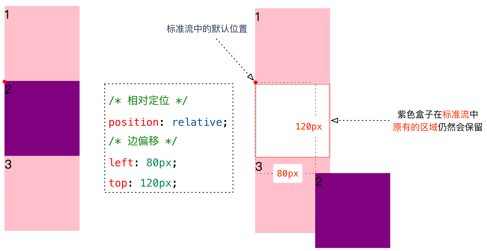
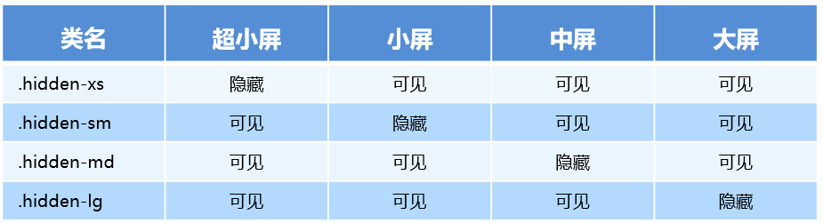

# CSS

Cascading  Style  Sheets （层叠样式表）

## 引入

### 内部样式（内联样式）

内部样式控制一个页面 （**权重最高**）

```html
<style type="text/css">
/* 样式 */
</style>
```

### 行内样式

行内样式控制一个标签

```html
<div style="color:red;">
    我是盒子
</div>
```

### 外部样式

外部样式控制整个站点

```html
1.使用标签关联
<link rel="stylesheet" type="text/css" href="css文件路径">
2.使用指令关联
<style type="text/css">
/* 在style标签中 */
    @import url("css文件路径")
</style>
```

## css基础属性

### 字体属性

- **字体大小 - font-size**：数字 + 像素单位(px)

- **字体粗细 - font-weight**

  - **normal**：正常（400）
  - **bold**：加粗（700）
  - **bolder**：(900)

- **字体风格 - font-style**：**normal**-正常（默认），**italic**-倾斜

- **字体类型 - font-family**：宋体，微软雅黑，黑体等

  - 多组用**逗号**隔开
  - **空格 # $ 特殊字符 中文**，需要**添加引号**

- **font简写**：`font: font-style  font-weight  font-size/line-height  font-family`

  - `font:italic bolder 30px/100px "微软雅黑";`

  >**font-size和font-family必写**，其余选写

  

### 文本属性

**文本修饰 - text-decoration**

- **underline**：下划线
- **overline**：上划线
- **line-through**：删除线
- **none**：无

**文本转换 - text-transform**

- **uppercase**：转大写
- **lowercase**：转小写
- **capitalize**：首字母大写

**文本对齐方式 - text-align**

- **left**：左对齐**（默认）**
- **center**：居中对齐
- **right**：右对齐

**首行缩进 - text-indent**

> 取值：px或em

**文本颜色 - color**


### css尺寸和行高

#### **尺寸**

**宽度**：`width:值`

**高度**：`height:值`

> 单位 px 或 em
>
> div不设高度，默认为0
>
> span设置宽度无效

#### **行高**

文字与文字之间的上下距离 `line-height:值`

行高   =  上距离 +  内容高度  + 下距离 

>标签的高度和行高设置成一样，标签文字在标签里垂直居中
>
>**一般行距比字体大6-8px**



### 背景属性 

**背景颜色**：`background-color:颜色值`

**背景图片**：`background-image:url(图片路径)`

**背景图片平铺**：`background-repeat:值`

- no-repeat：不平铺
- repeat-x：横向平铺
- repeat-y：纵向平铺

> 默认横纵都平铺

**背景图片位置**：`background-position:水平位置，垂直位置`

- top left bottom right center
- x y（单位px）

> 只有一个值为center，水平垂直为center
>
> 只有一个值为top left bottom right，另一个方向默认为center

**背景图片大小**：`background-size:宽度 高度`

**背景图填充**：center top

```css
html,body {height: 100%;}
body {
     background: url(img/vivo-bg.jpg) no-repeat center top;
     background-size: cover;
}      
```

**背景受滚动条的影响**：`background-attachment:值`

- **scroll**：当内容滚动到下方，图片会消失（**默认**）
- **fixed**：图片一直保持在视线范围内
- **inherit**：从父级继承

**图片定位参考**：`background-origin`

- **padding-box**：相对内边距定位
- **border-box**：相对边框定位
- **content-box**：相对内容框定位

**背景的绘制区域**：`background-clip`

- **padding-box**：裁剪到内边距框
- **border-box**：裁剪到边框
- **content-box**：裁剪到内容框

**背景透明**：`background:rgba()` ，取值 0-1 

**background简写**：`background: 背景颜色 背景图片地址 背景平铺 背景滚动 背景位置 背景大小;`

`background: transparent url(image.jpg) repeat-y  scroll center top ;`

**img 和 backgroud-image区别**

**img**

- 图片能撑开盒子
- 移动位置用 padding margin

**backgroud-image**

- 撑不开容器的 需要专门写宽高
- 移动位置 background-position


### **列表属性**

**列表前缀样式**：`list-style-type:none`

**列表前缀自定义图片**：`list-style-image:url(图片路径)`

>通常在网页中，使用的列表都是要去除前面的符号，并且去除左边和上边的空间

```css
ul{
    list-style:none;
    padding:0;
    margin:0;
}
```


## css选择器

### 基本选择器

| 基本选择器  |                         语法                         |                     例子                     |
| :---------: | :--------------------------------------------------: | :------------------------------------------: |
| 标签选择器  |                      标签{css}                       |                     p{}                      |
|  id选择器   |                      #id名{css}                      |                    #id{}                     |
| class选择器 |                      .类名{css}                      |                   .class{}                   |
| 复合选择器  | 标签和类选择器<br />多类同一元素<br />多标签同一样式 | p.class{}<br />.class1.class2{}<br />div,p{} |

### 常用选择器

|     常用选择器     |         说明         |                        语法                        |          例子          |
| :----------------: | :------------------: | :------------------------------------------------: | :--------------------: |
|     通配选择器     |   选择**所有元素**   |                       *{css}                       | *{padding:0;margin:0;} |
|   **后代选择器**   | 选择元素**里面元素** |                 外层 内层{css样式}                 |        div p{}         |
|  **子元素选择器**  | 选择元素直接子元素** |               父元素>子元素{css样式}               |        div>p{}         |
| **相邻元素选择器** |   选择**相邻**元素   | 元素1 + 元素2{css样式}<br />**通过元素1选到元素2** |        div+p{}         |

### 属性选择器

|     属性选择器     |               说明               |                      例子                       |
| :----------------: | :------------------------------: | :---------------------------------------------: |
|      [属性名]      |         具有该属性的元素         |                  input[value]                   |
|  [属性 **=** 值]   |        **等于该值**的元素        | input[name='myqz']<br />name='hello myqz hhaaa' |
| [属性 **~ =** 值]  |       **值包含该值**的元素       |               input[name~='myqz']               |
| [属性 **\| =** 值] | 连字符连接，且为第一个单词的元素 |   input[name\|='myqz'] <br />name='myqz-123'    |
|                    |                                  |                                                 |

[新增属性选择器](#新增属性选择器)

### 伪对象选择器

| :first-letter    | p:first-letter | 选择每个 <p> 元素的首字母。                         | 1    |
| ---------------- | -------------- | --------------------------------------------------- | ---- |
| **:first-line**  | p:first-line   | 选择每个 <p> 元素的首行。                           | 1    |
| **:first-child** | p:first-child  | 选择属于父元素的第一个子元素的每个 <p> 元素。       | 2    |
| **:before**      | p:before       | 在每个 <p> 元素的内容之前插入内容。                 | 2    |
| **:after**       | p:after        | 在每个 <p> 元素的内容之后插入内容。                 | 2    |
| **:lang**        | p:lang(it)     | 选择带有以 "it" 开头的 lang 属性值的每个 <p> 元素。 | 2    |

[新增伪对象选择器](#新增伪对象选择器)

### 伪类选择器

添加到选择器的关键字

- `:link`        正常连接时候的状态
- `:visited`   点击以后的状态
- `:hover`     鼠标移动上去的状态
- `:active`     鼠标按下去时候的状态
- `:focus`  选取获得焦点的元素 。 主要针对的是表单元素

> visited和link不能适用于普通标签，只有a标签才有
>
> 按照lvha顺序 - love hate
>
> 就近原则，将一般的放在上面，将特殊的放在下面，focus在hover和 active之间

[新增伪类选择器](#新增伪类选择器)

## css特性

### 样式的继承和覆盖

**覆盖**（层叠）：相同样式，后面覆盖前面。

> 选择器相同，就近原则。选择器不同，看优先级

**继承**：

父标签设置了样式，子标签都会具有父标签的样式

- **font-，text-，color，line- 能继承**
- **div不能继承高度，可以继承宽度**
- 子标签和父标签设置相同css，会覆盖父标签样式

### 样式优先级 

​	**样式分类**：`行内样式>内部/外部`，内部样式和外部样式没有权重之分，**看加载顺序**

​	**样式优先级**：`伪类首字>伪类首行>!important>id名>类名/属性>标签名>通配`

​	**样式叠加**：`!important(无穷大)   行内样式(1000)  id(100)   class(10)   标签(1)`

### 修改样式三步走

- 看标签是否选中
  - 选中，计算权重，谁大选谁
  - 没选择，权重为0（因为继承权重为0）

> 继承来的样式不计算权重，也就是说**关键看是不是直接修饰的目标标签**
>
> 每一级满10也不会往前进1  eg:10个标签的权重小于一个class

## <span style="color:red">标签显示模式</span>

### 1.块元素

宽度默认是容器（父级）100%，**高度默认0**，**会继承父级的宽度**，可以设置宽度和高度，**换行显示**

```
div、h1-h6、p、pre、ul、ol、li、form、table
```

> 文字才能组成段落 ，因此**p里面不能放块级元素，特别是p不能放div** 
>
> 文字类块级标签，**h1-h6、dt里面不能放其他块级元素**

### 2.行元素

宽度默认是**高度默认0，宽度为内容宽度**，不能设置宽和高，**一行显示**

```
a、strong、b、em、i、del、s、ins、u、span、label、img
```

>行内元素只能容纳文本或则其他行内元素
>
>img 行内级置换元素

### 3.行内块元素

默认**宽度为内容宽度**，能设置宽和高，不能换行显示

```
img、input、td
```

### 4.模式转换

`display:值`

- **block**：块元素
- **inline**：行元素
- **inline-block**：行内的块元素
- **none**：隐藏元素 （隐藏后不占空间）

## 盒子模型

### 内边距padding

添加了padding元素，**会增加盒子宽或高，需要手动减去**

- 1值-上下左右
- 2值-上下  左右
- 3值-上 左右 下
- 4值- 上 右 下 左 （顺时针）

<span style="color:red">默认撑开盒子，但是如果没有宽度或继承的宽度，padding不会撑开盒子</span>

### 外边距margin

块级盒子居中，有宽度，左右为auto 

> 没有宽度块级盒子100%，不存在居中

```css
/*写法1*/
margin:0 auto;
/*写法2*/
margin:auto;
/*写法3*/
margin-left:auto; /*左侧充满*/
margin-right:auto; /*右侧充满*/
/* 根据剩余长度居中对齐 */
```


> **行内元素尽量只设置 左右边距**

### 边框属性

**同padding，加边框后，盒子会变大**

**边框类型**：`border-style:值`

- **solid**：实线
- **dashed**：虚线
- **dotted**：点线
- **double**：双线

**边框颜色**：`border-color:颜色值`

**边框厚度**：`border-width:尺寸值`

**简写**：`border:宽度 类型 颜色` 

**边框圆角**：`border-radius:值`

- 左上角 右上角  右下角  左下角 (顺时针)
- border-top、border-right、border-bottom、border-left

**去边框**：border：none

**细线表格**：`border-collapse:collapse;`

- 合并相邻边框
- 表格和单元格都加边框属性

> 块级盒子没有width（包含继承）,添加padding和border不会撑大盒子

### 盒子模型的bug

**1.盒子上下摆放，上盒子有下外边距，下盒子有上外边距，两个边距会重合，以大的边距为准**


**解决**：避免或将这个间距都给到一个元素上面


**2.两个盒子嵌套关系，两个盒子对于上外边距会重合，以大的边距为准**


**解决**：

- 外部盒子加**border-top**或者上**padding-top**

- 外部盒子添加**oveflow:hidden**

### 盒子模型布局稳定性

```
width > padding > margin
```

- width：计算
- padding：盒子撑大
- margin：垂直外边距合并

### margin负值

- **水平垂直居中**：负边距+定位：


- **压住盒子相邻边**


## <span style="color:red">布局</span>

**标准流在最底层 (海底)  -------    浮动 的盒子 在 中间层  (海面)  -------   定位的盒子 在 最上层  （天空）**

### **标准流**

按照标签默认的特性摆放盒子

- 块级元素，从上向下
- 行内元素，从左到右，边缘换行

###  **浮动流**

 `float:left/right/none`

  - 普通流浮起来，脱离标准流，**浮在标准流上面**，**不占原来位置**
  - 任何元素都可浮动，**浮动后生成块级框（类似行内块）**，**不换行，能设置宽高** 
  - 设置浮动的元素，**居中不起作用**

#### 浮动元素重叠

- 行内元素与浮动元素发生重叠，边框、背景、内容都会显示在浮动元素之上

- 块级元素与浮动元素发生重叠，边框、背景会显示在浮动元素之下，内容会显示在浮动元素之上

#### 浮动元素位置

浮动元素换行

大盒子放不下了，浮动元素会掉下去，掉下去的元素位置根据上一个元素的高度

- 上一个元素高度比较大，高度的起始位置，第一个元素的下方
- 上一个元素高度比较小，在上一个元素的正下方


##### 浮动元素和父盒子

- 参照父盒子对齐
- 不会与边框重叠，也不会超过内边距

##### 浮动元素和兄弟盒子

- 前一个盒子浮动，当前盒子和前一个**顶部对齐**
- 前一个盒子标准流，根据实际情况，显示在前一个盒子**正下方或者后方**

> 浮动只**会影响当前或者后面标准流盒子**，不会影响前面

**应用**

- 盒子水平排列 - 给所有盒子添加浮动，可以用inline-block，但是盒子间空隙不方便处理
- 盒子左右对齐
- 文字环绕图片

#### 浮动问题

因为**盒子浮动不占位子**，无法撑开父盒子（高度为0），影响下面的标准流盒子


#### 清除浮动

**清除浮动造成的影响**，**浮动是脱标的，会影响下面标准流元素，需要给浮动元素添加一个标准流父亲，最大化减小对其他标准流的影响。**

  - 给父元素设置高度 (不推荐，高度一般可变)

  - **额外标签法(隔墙法)**：在浮动元素末尾添加一个空的标签

    ```css
    <div class='clear'></div>
    .clear{clear: both;}
    ```

    > 添加无意义标签，结构化差

  - **父级添加overflow属性方法** `overflow:auto`

    - hidden 溢出全部隐藏
    - auto 溢出产生滚动条

    >  内容增多时候容易造成不会自动换行导致内容被隐藏掉，无法显示需要溢出的元素

  - **使用after伪元素清除浮动**(**推荐**)

    ```css
    .clearfix:after { 
         content: "\200B"; 
         display: block; 
         height: 0; 
         clear: both;
         visibility: hidden; 
    } 
    
     .clearfix {*zoom: 1;}   /* IE6、7 专有 */
    ```
  
    > \200B - 零宽度空格，也可用 `.` ，可以不写
    >
    > block - 以块级显示，占满剩余空间
    >
    > height - 避免破坏原有布局
    >
    > clear:both - 清除浮动
    >
  > hidden  - 隐藏
    >
    > *zoom - 由于IE6-7不支持:after，使用 zoom:1触发 hasLayout

  - **使用双伪元素清除浮动(推荐)**
  
    ```css
    .clearfix:before,.clearfix:after { 
      content:"";
      display:table; 
    }
    
    .clearfix:after {
     clear:both;
    }
    .clearfix {
      *zoom:1;
    }
    ```

  >  table - 创建匿名单元格触发 bfc

### 定位流

**将盒子定位在某一位置**，可以让多个盒子前后叠压来显示，每个盒子需要测量数值

#### 静态定位

所有标准流都是静态定位

通常是将已经设置过定位的元素还原成标准流

`position:static`

#### 相对定位

**相对于自身**在标准流的位置进行定位移动	

`position：relative`

- 移动的出发点是**自身标准流**的位置
- 移动之后，自身在标准流中**还占有空间**
- **可以盖在标准流的上方**



#### 绝对定位

从父元素一直往上找设置过定位的直系父元素，作为自己的偏移参照物

`position:absolute`

- 偏移位置参考**设置过定位（相对/绝对/固定）的直系父元素或直系祖宗元素**，没找到就一直往上级找，直到html
- 会**脱**离**标**准流，**不再继承父级的宽度,大小取决于内容**，可以定义宽高，**不占据标准流的空间**
- **margin:auto**对于设置过绝对定位的元素**不起作用**
- 横向或者纵向只设置一个即可，设置多个没有意义

如果父级（祖先）没有定位则**相对于html**，以下为父级有定位


**水平垂直居中**

```css
	.box{
			width:100px;
			height:100px;
			border:1px solid #000;
			position:absolute;/* 设置绝对定位 */
			top:50%;/* 设置上边偏移 */
			margin-left:-50px;/* 往左边移动自身宽度的一般 */
			left:50%;/* 设置做边偏移 */
			margin-top:-50px;/* 往上面移动自身高度的一半 */
		}
```

定位：**父相子绝**

**父级元素**是绝对，脱标会导致后续标准流元素上移。只能是相对

**子级元素**则不能占位置，需要浮在父元素上


#### 固定定位

**以浏览器作为参考进行偏移**，且滚动条对固定定位无效

`position:fixed`

- 会**脱**离**标**准流，**不占**据标准流的**空间**，**不继承**父元素的**宽高**，需要给**自身定义宽高**
- **margin:auto**对固定定位的元素**不起作用**
- 不会随着滚动条滚动，永远固定在**浏览器窗口**中的位置


| 定位模式         | 是否脱标占有位置     | 是否可以使用边偏移 | 移动位置基准                 |
| ---------------- | -------------------- | ------------------ | ---------------------------- |
| 静态static       | 不脱标，正常模式     | 不可以             | 正常模式                     |
| 相对定位relative | 不脱标，占有位置     | 可以               | **相对于自身**位置移动       |
| 绝对定位absolute | 完全脱标，不占有位置 | 可以               | **相对于定位的父级**移动位置 |
| 固定定位fixed    | 完全脱标，不占有位置 | 可以               | **相对于浏览器**移动位置     |

#### 定位元素层叠效果

控制“定位”元素的叠放层级

`z-index:值`

- 数字
  - 正数，数字越大，层级越高，离用户越近 **>auto**
  - 负数，数字越小，层级越低，离用户越远 **<auto**
- auto：与父元素同级（**默认**）

**特性**：

- <span style="color:red">z-index只针对定位元素有效果（但不包括静态定位）</span>
- z-index值越大，层级越高
- **父元素比较过层级**（父元素都有z-index值，且不为auto），子元素之间是不会再去比较的
- auto < 1

```css
		/* 两个盒子都设置相对定位并偏移，中间有重叠的部分，默认后设置的会覆盖先设置的 */
		.box{
			width:100px;
			height:100px;
			background:#f00;
			position:relative;
			top:50px;
			z-index:2;/* 设置层叠高一点，会覆盖后设置的 */
		}
		.box1{
			width:200px;
			height:200px;
			background:#0f0;
			position:relative;
			left:50px;
		}
```


### 扩展 - display

display 是 显示模式

* 可以用**inline-block**  转换为行内块
* 可以用**浮动 float 默认转换为行内块**（并不完全一样，因为浮动是脱标的）
* **绝对定位和固定定位**， 默认转换特性 转换为行内块。

>**浮动元素、绝对定位(固定定位）**元素的都**不会触发外边距合并的问题**

### 侧边栏定位


## css3

### 阴影

**文本阴影**：`text-shadow:横向偏移 纵向偏移 模糊距离 颜色`

**边框阴影**：`box-shadow:水平位置 垂直位置 模糊距离 阴影尺寸（影子大小） 阴影颜色  内/外阴影`

```css
div {
			width: 200px;
			height: 200px;
			border: 10px solid red;
			box-shadow: 0 15px 30px  rgba(0, 0, 0, .4) outset;
    		/*默认outset，设置inset为内阴影*/
			
}
```

>边框阴影和边框没有关系

### 内减模式

将padding内边距和边框带来增大盒子的影响去掉，**不能去margin影响**

**css3盒子模型**

`box-sizing:border-box;`

> **传统盒子模型**
>
> box-sizing: content-box

### 新增属性选择器

[属性选择器](#属性选择器)

|    属性选择器     |             说明             |
| :---------------: | :--------------------------: |
| **[属性 ^ =值]**  | 以指定字符开头的属性值的元素 |
| **[属性 $ =值]**  | 以指定字符结尾的属性值的元素 |
| **[属性 * = 值]** |     **包含当前值**的元素     |

### 新增伪类选择器

[伪类选择器](#伪类选择器)

|      伪类选择器      |              作用               |
| :------------------: | :-----------------------------: |
|        :root         |          可以理解为根           |
|  **E:first-child**   |  **匹配父元素中第一个子元素E**  |
|   **E:last-child**   | **匹配父元素中最后一个子元素E** |
|  **E:nth-child(n)**  |  **匹配父元素中第n个子元素E**   |
|  E:nth-child(even)   |     匹配父元素奇数位子元素E     |
|   E:nth-child(odd)   |     匹配父元素偶数位子元素E     |
|       E:empty        |  匹配父元素中内容为空的子元素E  |
| **E:nth-of-type(n)** |      **匹配第n个子元素E**       |
|   E:first-of-type    |        匹配第一个子元素E        |
|    E:last-of-type    |       匹配最后一个子元素E       |
|     E:only-child     |           唯一子元素            |

**nth-child和nth-of-type区别**

`p:nth-child(2)` - 第2孩子且是p标签，如果第2孩子不是标签，则会失效

`p:nth-of-type(2)` - 孩子中第二个p标签

**nth-child扩展**

- 2n - 偶数
- 2n+1 - 奇数
- 5n - 5 10 15
- n+5 - 从第5个开始
- -n+5 - 前5个
- **n从0开始，但是大于0才有效**

### 新增伪对象选择器

[伪对象选择器](#伪对象选择器)

给元素追加一个**虚拟标签**，由css加载，可以节省html的资源开销

- `::after`：指定标签后添加一个对象
- `::before`：指定标签前添加一个对象

:after 和 ::after 区别

- css3引入用于区别伪类和伪元素，`:`伪类，`::`伪元素，css3伪元素不支持 `:`写法
- 对于之前有的伪元素，`:`和`::`效果相同，兼容ie用`:`，其他用`::`

```css
元素::after{
    content:"";
}
```

<span style="color:red">注意：伪对象样式中，必须有content属性，否则伪对象无效</span>

> 伪对象不是实际标签，使用css样式模拟一个标签
>
> 伪元素是行元素
>
> 权重为1

### 2D转换

#### 移动 - translate

`transform:translate(x,y);`

>使用translateX和translateY设置x轴或者y轴，里面只设置一个值即可

- `translate` 中100%，是相对于**本身的宽度和高度**来进行计算
- **行内标签没有效果**

> **不影响其他元素的位置**

#### 旋转 - rotate

`transform:rotate(角度);`

- 单位：deg。值为正，顺时针。值为负，逆时针。

**设置旋转中心点**

`transform-origin:横向坐标 纵向坐标;`

- 默认中心点 （50% 50%）（center center）
- 取值：**像素（px） 或 方位名词（left,right,top,bottom,center）**

#### 缩放 - scale

`transform:scale(值)`

- 倍数（整数，小数），两个值（宽度，高度）

> **中心点缩放，不影响其他盒子**

#### 综合写法

`tranform:translate() rotate() scale()`

- 顺序会影响转换效果（先旋转会改变坐标轴方向）
- 尽量先写位移

### 过渡

`transition:动画css属性 过渡时间秒数 速度类型 延迟的秒数` 

#### 基本使用

```css
img{
	display:block;
	margin:50px auto;
	border:1px solid #000;
	/* 加过渡效果，必须是在元素原本的样式上面加，不在伪类上加 */
	transition:transform 2s linear;
}
img:hover{
	transform:scale(1.5);	
}
```

#### 常用属性

| 属性                       |               描述                |
| -------------------------- | :-------------------------------: |
| transition                 |             简写属性              |
| transition-property        |   规定应用过渡的 CSS 属性的名称   |
| transition-duration        |   过渡效果花费的时间。默认是 0s   |
| transition-timing-function | 过渡效果的时间曲线。默认是 "ease" |
| transition-delay           |    过渡效果何时开始。默认是0s     |

#### 运动曲线

- linear - 匀速
- ease - 逐渐慢下来
- ease-in - 加速
- ease-out - 减速
- ease-in-out - 加速再减速


### 动画

#### 基本使用

通过设置多个节点来精确的控制一个或者一组动画，从而实现复杂的动画效果

- 先定义动画
- 调用定义好的动画

```css
/*定义*/
@keyframes 动画名称 {
    0% {
        width: 100px;
    }
    100% {
        width: 200px
    }
}
/*调用*/
div {
	/* 调用动画 */
    animation-name: 动画名称;
 	/* 持续时间 */
 	animation-duration: 持续时间；
}
```

- **动画序列**：0% （from）是动画开始，100 % （to）是动画完成
- 在 @keyframs 中规定某项 CSS 样式，就由创建**当前样式逐渐改为新样式的动画效果**，可以改变多次

#### 常见属性

|           属性            |                             描述                             |
| :-----------------------: | :----------------------------------------------------------: |
|      **@keyframes**       |                           规定动画                           |
|       **animation**       |                           简写属性                           |
|    **animation-name**     |                    动画的名称（**必须**）                    |
|  **animation-duration**   |    动画完成一个周期花费秒或毫秒<br />默认0。（**必须**）     |
| animation-timing-function |               规定动画的速度曲线，默认是“ease”               |
|      animation-delay      |                       **动画何时开始**                       |
| animation-iteration-count |            动画被播放的次数，默认1<br />infinite             |
|    animation-direction    | 是否在下一周期逆向播放<br />normal正常（默认），alternate逆向 |
|   animation-play-state    | 动画是否正在运行或暂停<br />running运行（默认），paused暂停  |
|  **animation-fill-mode**  |    动画结束后状态<br />forward终点（默认），backwards起点    |

#### 速度曲线

|     属性      |               描述               |
| :-----------: | :------------------------------: |
|  **linear**   |               匀速               |
|   **ease**    | 低速开始，加快，慢慢减速（默认） |
|    ease-in    |             低速开始             |
|   ease-out    |             低速结束             |
|  ease-in-out  |        低速开始，低速结束        |
| **steps（）** |     指定时间间隔数量（步长）     |

#### 动画简写

```css
/* animation: 动画名称 持续时间 运动曲线 何时开始 播放次数 是否反方向 起始与结束状态 */
animation: name duration timing-function delay iteration-count direction fill-mode
```

> 简写属性不包括**animation-play-state**  

```css
/*匀速移动2s，1s后开始，无限循环，逆向，终点*/
animation: move 2s linear 1s infinite alternate forwards;
```

### 3D转换

**近大远小，物体和面遮挡不可见**

- x 轴：水平向右
- y 轴：垂直向下

- z 轴：垂直屏幕 


#### 位移 - translate3d

`transform: translate3d(x, y, z)`：其中x、y、z 分别指要移动的轴的方向的距离。**xyz不能省略，用0填充**

>translateX、translateY、translateZ

#### 旋转 - rotate3d

`transform: rotateX(45deg)` -- 沿着 x 轴正方向旋转 45 度
`transform: rotateY(45deg)` -- 沿着 y 轴正方向旋转 45 度
`transform: rotateZ(45deg)` -- 沿着 z 轴正方向旋转 45 度

- xyz表示角度

`transform: rotate3d(x, y, z, 45deg)`：沿自定义轴旋转 45 deg 为角度

- xyz表示旋转矢量

```css
transform: rotate3d(1, 1, 0, 180deg) /*沿着对角线旋转 45deg*/
transform: rotate3d(1, 0, 0, 180deg) /*沿着 x 轴旋转 45deg*/
```

#### 左手准则

- **rotateX**：左手的**拇指**指向 x 轴**正方向**，**其余手指**弯曲方向就是该元素沿着 x 轴**旋转方向**
- **rotateY**：左手的**拇指**指向 y 轴**正方向**，**其余手指**弯曲方向就是该元素沿着 y 轴**旋转方向**
- **rotateZ**：无

#### 透视 - perspctive

透视也称为视距，就是人的眼睛到屏幕的距离。

- 距离视觉点越近的在电脑平面成像越大，越远成像越小

- 单位像素
- **透视需要写在被视察元素的父盒子上面**

```css
body {
  perspective: 1000px;
}
```

**translateZ** 与 **perspecitve** 的区别

**translateZ** 给子元素设置，**perspecitve** 给父级设置


#### 呈现 - transfrom-style

控制子元素是否开启三维立体环境

`transform-style: flat` - 子元素不开启 `3D` 立体空间（默认）

`transform-style: preserve-3d` - 子元素开启立体空间

>写在父级，影响子盒子

### 媒体查询

媒体查询（Media Query）是CSS3新语法。

+ 使用 @media查询，可以针对不同的媒体类型定义不同的样式
+ @media 可以针对不同的屏幕尺寸设置不同的样式
+ 当你重置浏览器大小的过程中，页面也会根据浏览器的宽度和高度重新渲染页面 

#### 语法规范

- **@media**  - 开头
- **mediatype** - 媒体类型
  - **all** - 所有设备
  - **print**  - 打印机和打印预览
  - **screen** - 电脑、平板、手机
- **and not only** - 关键字
  - **and** - 多个媒体类型连接到一起
  - **not** - 排除某个媒体类型  （可省）
  - **only** - 指定某个媒体类型  （可省）

- **media feature** - 媒体特性
  - **width** (可见区域)| **min-width** （最小可见区域）| **max-width**（最大可见区域）

```css
@media mediatype and|not|only (media feature) {
    CSS-Code;
}
```

> ​	尽量从小到大书写，由于权重关系，可使代码更简洁

## css补充

### 光标形状 cursor

`cursor:值`

| 属性值          | 描述                                          |
| --------------- | --------------------------------------------- |
| **default**     | 箭头（默认）                                  |
| **pointer**     | 小手                                          |
| **move**        | 移动                                          |
| **text**        | 文本                                          |
| **not-allowed** | 禁止                                          |
| **help**        | 问号                                          |
| **url()**       | 临时替换样式<br />`cursor:url('*.ico'),auto;` |

### 轮廓线 outline

`outline:值`

```css
 outline : outline-color ||outline-style || outline-width 
```

应用： `outline: 0;`   或者  `outline: none;`

### 元素可见性

`visibility:值` （**占空间**）

- hidden隐藏
- visible可见

`display:none`（**不占空间**）

> 应用：js特效，下拉菜单

`overflow:值`

- **auto**：内容溢出时，生成滚动条（**默认**）
- **hidden**：内容溢出时超出部分隐藏
- **scroll**：右边和下边都有滚动条	
- **visible**（默认）：不剪切内容，也不加滚动条

> 水平方向溢出可以使用overflow-x，纵向溢出使用overflow-y
>
> 应用：清除浮动，保证内容不超出盒子

### **行内文字溢出省略号显示**

**white-space**：设置或检索对象内文本显示方式

- **normal** - 默认
- **nowarp** - 一行显示（直到文本结束or br标签）

**text-overflow**：设置或检索是否使用一个省略标记

- **clip**：不显示
- **ellipsis**：溢出省略号显示

```css
overflow:hidden;
white-space: nowrap;/* 设置文本不换行，单行显示 */
text-overflow:ellipsis;/* 超出的文本使用省略号代替 */
```

### 多行溢出省略号

```css
display: -webkit-box; /*弹性伸缩盒子模型*/
-webkit-box-orient: vertical; /*伸缩盒子子排列方式*/
-webkit-line-clamp: 3; /*设置显示文本行数*/
text-overflow: ellipsis;
overflow: hidden;
```


### 多栏布局

**分栏显示**：`column-count:值` 

- 值：栏目的数量

**多栏隔断框**：`column-rule:值` 

- 取值同边框

**每一栏的宽度**：`column-width:值`

### <span style="color:red">对齐</span>

#### 水平居中

|            | margin:0 auto； | text-align:center;   |
| ---------- | --------------- | -------------------- |
| 针对的对象 | 块元素          | 行元素和行内块       |
| 居中的范围 | 盒子本身        | 盒子中的文字和行内块 |

#### 垂直居中

只针对**行内元素或行内块元素**

```css
vertical-align : baseline |top |middle |bottom 
```

> 设置在img上

**应用**：图片/表单与文字的对齐


#### **图片底侧空白缝隙**问题

原因：图片或者表单等行内块元素，他的**底线会和父级盒子的基线对齐**

- 设置图片对齐方式(除了baseline) - `vertical-align:middle | top| bottom`
- 将图片转为块级，**垂直对齐对块级无效** - `display:block` 

#### 垂直居中补充

##### table

```css
parent {
display: table;
}
child {
display: table-cell;
vertical-align: middle;
}
```

##### 弹性布局

```css
parent {
display: flex;
align-items: center;
}
```

##### 定位

```css
parent {
position: relative;
}
child {
position: absolute;
top: 50%;
transform: translateY(-50%);
}
```

##### 伪元素

```css
parent:after {
content: '';
display: inline-block;
height: 100%;
vertical-align: middle;
width: 0;
}
child {
display: inline-block;
vertical-align: middle;
}
```


### 其他

**去掉文本域自动拉伸**：`resize:none;`

**透明度**：`opacity:值` （ 0 - 1）

**背景透明**：`rgba(值1，值2，值3，值4)`

- 值123：颜色（0-255）
- 值4：透明度

**缩放ZOOM**：`zoom:值`

- 倍数（整数，小数）

**zoom和transform区别**

`zoom：2`


`transform:scale(2);`


## css其他

### css精灵技术

网页加载每一张图片都需要对服务器进行一次请求，所以对服务器的负荷会很大，可以将多个小图放到一张大图上，每个地方使用小图片都对大图进行背景定位即可，这样只需要加载一张大图片，对服务器只做一次请求，可以减少服务器的开销，提供网站的性能

**精灵图制作**

- 打开ps，新建图片，空白背景
- 堆叠图片，修改图层名字
- 隐藏背景，ctrl+s存储，选择png

### css三角形

- 宽度高度为0
- 兼容低版本的浏览器，加上 `font-size: 0;  line-height: 0;`
- 4个边框都要写， 保留的边框，其余的不能省略 

```css
 div {
 	width: 0; 
    height: 0;
    line-height:0；
    font-size: 0; 
	border-top: 10px solid red;
	border-right: 10px solid green;
	border-bottom: 10px solid blue;
	border-left: 10px solid #000; 
 }
p {
    width: 0;
    height: 0;
    line-height: 0;
    font-size: 0;
    border-width: 10px;
    border-style: solid;
    border-color: transparent transparent transparent red;
}
```


> 顺时针：上-右-下-左

# 移动web

## 视口

视口（viewport）就是浏览器显示页面内容的屏幕区域。 视口可以分为布局视口、视觉视口和理想视口

### 布局视口 layout viewport

移动设备的浏览器都默认设置了一个布局视口。


### 视觉视口 visual viewport

用户正在看到的网站的区域（网站区域）


### 理想视口 ideal viewport

使网站在移动端有最理想的浏览和阅读宽度而设定

**手动添写meta视口标签通知浏览器操作**


## 二倍图

**物理像素**：屏幕显示的最小颗粒，是真实存在

**物理像素比或屏幕像素比**：一个px的能显示的物理像素点的个数

**背景缩放**：属性规定背景图像的尺寸

- **单位**  长度|百分比|cover|contain
  - **cover** - 背景扩展足够大，完全覆盖
  - **contain** - 扩展为最大尺寸，**高度或宽度适应**

```css
background-size: 背景图片宽度 背景图片高度;
```

> 只写一个参数，参数为高度

## 主流方案

**单独制作移动端页面**（主流）

- 网址域名前面加 m(mobile)，PC端和移动端为两套网站
- 常用技术
  - 流式布局（百分比布局）
  - flex 弹性布局（强烈推荐）
  - less+rem+媒体查询布局

**响应式页面兼容移动端**（其次）

- 即pc和移动端共用一套网站，不同屏幕下，样式会自动适配
- 常用技术
  - 媒体查询
  - bootstarp

**移动端浏览器兼容问题**：移动端浏览器基本以 webkit 内核为主

> 移动端 CSS 初始化推荐使用 normalize.css 

**特殊样式**

```css
/*CSS3盒子模型*/
box-sizing: border-box;
-webkit-box-sizing: border-box;
/*点击高亮我们需要清除 设置为transparent 完成透明*/
-webkit-tap-highlight-color: transparent;
/*在移动端浏览器默认的外观在iOS上加上这个属性才能给按钮和输入框自定义样式*/
-webkit-appearance: none;
/*禁用长按页面时的弹出菜单*/
img,a { -webkit-touch-callout: none; }
```

## flex布局

flex 是 flexible Box 的缩写，意为"弹性布局"，**任何一个容器都可以指定为 flex 布局**。

实现类似浮动的效果，但是不会脱离文档流

`display:flex`

### 传统布局

+ 兼容性好
+ 布局繁琐
+ 局限性，不能再移动端很好的布局

### flex布局

+ 操作方便，布局极其简单，移动端使用比较广泛
+ pc端浏览器支持情况比较差
+ IE11或更低版本不支持flex或仅支持部分

> pc传统，移动端或不考虑兼容性pc用flex

### flex注意

- <span style="color:red">父盒子设为 flex 布局以后，**子元素的 float、clear 和 vertical-align 属性将失效**</span>

- 采用 Flex 布局的元素，称为 Flex 容器（flex container），简称"容器"。它的所有子元素自动成为容器成员，称为 Flex 项目（flex item），简称"项目"

通过给**父盒子添加flex属性**，来**控制子盒子**的位置和排列方式


### 父项常见属性

|        属性         |                        说明                        |
| :-----------------: | :------------------------------------------------: |
| **flex-direction**  |                   **主轴的方向**                   |
| **justify-content** |             **主轴上的子元素**排列方式             |
|    **flex-wrap**    |               设置子元素**是否换行**               |
|  **align-content**  |       **侧轴上的子元素**排列方式（**多行**）       |
|   **align-items**   |       **侧轴上的子元素**排列方式（**单行**）       |
|    **flex-flow**    | 复合属性<br />同时设置 flex-direction 和 flex-wrap |

#### 主轴方向 - flex-direction

- **row** ：横向排列（左右）
- **row-reverse**： 横向反向排列（右左）
- **column** ：纵向排列 （上下）
- **column-reverse** ：纵向反向排列（下上）

> **默认主轴x，水平向右，默认侧轴，垂直向下**

#### 主轴子元素排列 -  justify-content

- **flex-start**：从头部开始（**默认**）（主轴为x，左右）
- **flex-end**：从尾部开始
- **center**： 居中对齐
- **space-between**：两端对齐，中间等距离隔开
- **space-around**：环绕对齐，两端的空白是中间空白的一半
- **space-evenly**：等距离排列

#### 是否换行 - flex-wrap

- **nowarp**：不换行（**默认**）
- **warp**：换行
- **wrap-reverse**： 换行，反向排列，（从下到上，从左到右）

#### 侧轴子元素排列（单行）- aligin-items

- **flex-start**：从头部开始
- **flex-end**：从尾部开始
- **center**：居中
- **baseline**：在基准线对齐
- **stretch**：拉伸子元素（图片不行）

#### 侧轴子元素排列（多行）- aligin-content

- **stretch**：靠上排列，元素之间有间距（**默认**）
- **flex-start**：从头部开始
- **flex-end**：从尾部开始
- **center**： 居中对齐
- **space-between**：两端对齐，中间等距离隔开
- **space-around**：环绕对齐，两端的空白是中间空白的一半
- **space-evenly**：等距离排列


> `flex-direction:row;`   `flex-wrap:wrap;`
>
> 等价写法
>
> `flex-flow:row wrap`


### 子项常见属性

|      属性      |            说明            |
| :------------: | :------------------------: |
|    **flex**    |  子项目占的份数，默认为0   |
| **align-self** |     子项在侧轴排列方式     |
|   **order**    | 子项的排列顺序（前后顺序） |

#### 子项自身在侧轴排列 - align-self

- **auto**：继承父容器align-items属性，没有父容器则为"stretch"（**默认**）
- **stretch**：拉伸
- **center**：居中
- **flex-start**：最上面
- **flex-end**：最下面
- **baseline**：容器的基线

>**align-items**：修饰弹性容器所有子元素
>
>**align-self**：修饰当前元素


#### 子项排列顺序 - order

数值越小，越靠前，默认为0。


## rem布局

rem(root em)：一个相对单位，类似于em，em是父元素字体大小。**rem基于html元素字体大小**

> 父元素文字大小可能不一致， 但只有一个html

### rem适配方案

使用媒体查询根据不同设备按比例设置html的字体大小，然后页面元素使用rem做尺寸单位，当html字体大小变化元素尺寸也会发生变化，从而达到等比缩放的适配。

技术方案

- **less+rem+媒体查询**

- **flexible.js+rem**（推荐）
  - 原理是把当前设备划分为10等份
  - 设计稿是 750px， 那么我们只需要把 html 文字大小设置为75px(750px / 10) 就可以

 **VSCode  px 转换rem 插件 cssrem**


需要修改 **cssrem**


① 最后的公式： <span style="color:red">页面元素的rem值 =  页面元素值（px） /  （屏幕宽度 /  划分的份数）</span>
② html font-size 的大小 = 屏幕宽度/划分的份数
③ 页面元素的rem值 =  页面元素值（px） /  html font-size 字体大小


## 响应式布局

使用媒体查询针对不同宽度的设备进行布局和样式的设置，从而适配不同设备的目的。

|   设备   |      尺寸       | 版心 |
| :------: | :-------------: | :--: |
| 超小屏幕 |   尺寸 < 768    | 100% |
|   平板   | 768< 尺寸 <992  | 750  |
|  显示器  | 992< 尺寸 <1200 | 970  |
| 大显示器 |   1200 < 尺寸   | 1170 |

### Bootstrap

http://www.bootcss.com/

http://getbootstrap.com/

http://bootstrap.css88.com/

#### 骨架

```html
<!DOCTYPE html>
<html lang="zh-CN">
  <head>
    <meta charset="utf-8">
   <!--要求当前网页使用IE浏览器最高版本的内核来渲染-->
	<meta http-equiv="X-UA-Compatible" content="IE=edge">
	<!--视口的设置：视口的宽度和设备一致，默认的缩放比例和PC端一致，用户不能自行缩放-->
	<meta name="viewport" content="width=device-width, initial-scale=1, user-scalable=0">

    <title>Bootstrap 101 Template</title>

    <!-- Bootstrap -->
    <link href="css/bootstrap.min.css" rel="stylesheet">

    <!-- HTML5 shim and Respond.js for IE8 support of HTML5 elements and media queries -->
    <!-- WARNING: Respond.js doesn't work if you view the page via file:// -->
      <!--[if lt IE 9]>
	<!--解决ie9以下浏览器对html5新增标签的不识别，并导致CSS不起作用的问题-->
	<script src="https://oss.maxcdn.com/html5shiv/3.7.2/html5shiv.min.js"></script>
	<!--解决ie9以下浏览器对 css3 Media Query 的不识别 -->
	<script src="https://oss.maxcdn.com/respond/1.4.2/respond.min.js"></script>
	<![endif]-->
  </head>
  <body>
    <h1>你好，世界！</h1>

    <!-- jQuery (necessary for Bootstrap's JavaScript plugins) -->
    <script src="//cdn.bootcss.com/jquery/1.11.3/jquery.min.js"></script>
    <!-- Include all compiled plugins (below), or include individual files as needed -->
    <script src="js/bootstrap.min.js"></script>
  </body>
</html>
```

#### 布局容器

Bootstrap 需要为页面内容和栅格系统包裹  .container 或者.container-fluid 容器

##### .container

+ 响应式布局的容器  **固定宽度**
+ 大屏 ( >=1200px)  宽度定为 1170px
+ 中屏 ( >=992px)   宽度定为  970px
+ 小屏 ( >=768px)   宽度定为  750px
+ 超小屏  (100%) 

##### .container-fluid

+ 流式布局容器 百分百宽度
+ 占据全部视口（viewport）的容器

#### 栅格系统

Bootstrap提供了一套响应式、移动设备优先的流式栅格系统，随着屏幕或视口（viewport）尺寸的增加。

+ 按照不同屏幕划分为1~12 等份
+ 数据行 (.row) 必须包含在容器（ .container ）中，以便为其赋予合适的对齐方式和内距
+ 列（column）大于 12，多余的“列（column）”所在的元素将被作为一个整体另起一行排列
+ **每一列默认有左右15像素的 padding**
+ **行（row） 可以去除父容器作用15px的边距**
+ 可以同时为一列指定多个设备的类名，以便划分不同份数

> xs-extra small：超小
>
> sm-small：小
>
> md-medium：中等
>
> lg-large：大

##### 栅格嵌套

**一个列内再分成若干份小列**。我们可以通过添加一个新的 .row 元素和一系列 .col-sm-* 元素到已经存在的 .col-sm-*

```html
<!-- 列嵌套 -->
<div class="col-sm-4">
    <div class="row">
         <div class="col-sm-6">小列</div>
         <div class="col-sm-6">小列</div>
    </div>
</div>
```

##### 列偏移

使用 .col-md-offset-* 类可以将列向右侧偏移。通过加margin实现。

```html
 <!-- 列偏移 -->
  <div class="row">
      <div class="col-lg-4">1</div>
      <div class="col-lg-4 col-lg-offset-4">2</div>
  </div>
```

##### 列排序

通过使用 .col-md-push-* 和 .col-md-pull-* 类就可以很容易的改变列（column）的顺序

```html
 <!-- 列排序 -->
  <div class="row">
      <div class="col-lg-4 col-lg-push-8">左侧</div>
      <div class="col-lg-8 col-lg-pull-4">右侧</div>
  </div>
```

响应式

针对不同设备展示或隐藏页面内容



## 其他

### 背景线性渐变

```css
background: linear-gradient(起始方向, 颜色1, 颜色2, ...);
background: -webkit-linear-gradient(left, red , blue);
background: -webkit-linear-gradient(left top, red , blue);
```

**背景渐变必须添加浏览器私有前缀**
起始方向可以是： **方位名词 或者 度数** ， 如果省略默认就是 top


# less

Less（LeanerStyle Sheets 的缩写）是一门 CSS扩展语言，也成为CSS预处理器。

Less中文网址：[http://](http://lesscss.cn/)[less](http://lesscss.cn/)[css.cn/](http://lesscss.cn/)

```shell
npm install -g less # 安装
lessc -v # 查看版本
```

## less变量

- 以@为前缀
- 不包含特殊字符
- 不能以数字开头
- 大小写敏感

```less
@变量名：值;
```

vscode插件

保存一下Less文件，会自动生成CSS文件


## less嵌套

**交集|伪类|伪元素选择器，利用&连接**

```less
#header .logo {
  width: 300px;
}

#header {
    .logo {
       width: 300px;
    }
    &:hover {
       color:red;
    }
}
```

## less运算

任何数字、颜色或者变量都可以参与运算。就是Less提供了加（+）、减（-）、乘（*）、除（/）算术运算。

```less
/*Less 里面写*/
@witdh: 10px + 5;
div {
    border: @witdh solid red;
}
/*生成的css*/
div {
  border: 15px solid red;
}
/*Less 甚至还可以这样 */
width: (@width + 5) * 2;
```

+ 运算符中间左右有个空格隔开
+ **两个不同的单位的值运算，结果值取第一个值的单位** 
+ **两个值之间只有一个值有单位，则运算结果就取该单位**

# 补充

## BFC

BFC(Block formatting context)直译为"块级格式化上下文"。它是一个独立的渲染区域，只有Block-level box参与,

哪些情况会产生BFC:

1. 根元素
2. float属性不为none
3. position为absolute或fixed
4. display为inline-block, table-cell, table-caption, flex, inline-flex
5. overflow不为visible