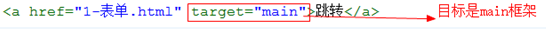

## 标签

### 分类

双标签：成对出现的标签，内容写在标签中间`<p>段落</p>`

单标签：单个的标签，没有内容只有属性`<hr>`

### 属性

每个标签都有属性，一个标签可以有多个属性

`<标签名 属性1="值1" 属性="值2"></标签名>`

#### 通用属性

**id**：标签的唯一标识，id属性必须是唯一

**class**：使用class属性值给标签设置样式

**name**：标签名字

**style**：标签样式

### 常见标签

#### 标题

一级标题：`<h1></h1>`
二级标题：`<h2></h2>`
...
六级标题：`<h6></h6>`

>标题标签在SEO搜索引擎中权重比较大
>
>SEO：（Search Engine Optimization）：汉译为[搜索引擎](https://baike.baidu.com/item/%E6%90%9C%E7%B4%A2%E5%BC%95%E6%93%8E)优化
>

#### 排版

**段落**：`<p></p>`
**水平线**：`<hr>`
**换行**：`<br>`

**预排版标签**

```html
<pre>
    									上
    左																右
    									下
</pre>
```

#### 字体

**粗体**：`<b></b>`
**斜体**：`<i></i>`
**下划线**：`<u></u>`

#### 强调

**粗体**：`<strong></strong>`
**斜体**：`<em></em>`
**下划线**：`<ins></ins>`

> 强调标记SEO中权重更大

#### 图片

``

### 列表

#### 无序列表 

```html
<ul>
   <li type='circle'>空心圆</li>
   <li type='square'>正方形</li>
   <li type='disc'>实心圆-默认</li> 
</ul>
```

#### 有序列表

```html
<ol>
    <li type='A'>大小写英文字母(A,a)</li>
    <li type='i'>大小写罗马数字(I,i)</li>
    <li type='1'>阿拉伯数字-默认</li>
</ol>
```

#### 自定义列表

```html
<dl>
    <dt>标题</dt>
	<dd>标题的补充</dd>
</dl>
```

### 超链接

`<a></a>`

**target**

- _blank：跳转到新页面
- _self：原页面上打开

**title**：鼠标悬浮显示的值

**内部链接**：本地跳转 `href='index.html'`

**外部链接**：跳转到其他网站 `href='www.baidu.com'`

**下载链接**：跳转到浏览器无法打开的文件 `href='my.ppt'`

**锚点链接**：跳转到指定锚点处 `href='#ss'` `<p id='ss'></p`

> **p元素不能包含任何块级元素(包括自身)**
>
> **a元素可以包含任何其他元素(除了自身)**

```html
<p>123<p>456</p></p>
<!-- 被浏览器解析 -->
<p>123</p>
<p>456</p>
```


### 表格标签

**表格**：`<table></table>`

**行**：`<tr></tr>`

**单元格**：`<td></td>`

**列标题**：`<th></th>`

**表格标题**：`<caption></caption>`

**边框**：`<table border = 1>`

**单元格对齐方式（td）**

- 水平对齐：`align="center/left/right"`
- 垂直对齐：`valign="top/middle/bottom"`

**单元格间距和填充（table）**

- 格间距（cellspacing）：单元格和单元格距离，默认是2像素

- 单元格填充（cellpadding）：单元格和内容的距离，默认是1像素

**合并单元格**

- 合并行(rowspan)：把不同的行合并起来，写在上面的单元格上面

- 合并列(colspan)：把不同列合并起来，写在左边的单元格上面

>取值是合并的单元格数量，合并了单元格，需删除多余单元格

### 块标签

**div标签**：存放一切内容

**span标签**：一般只用于存放文字

### 表单标签

**表单域**：`<form></form>`，放置所有的表单元素

- **action**：数据提交的地址

- **name**：服务器接收数据靠的就是表单的name属性

- **method**：请求方式

- **enctype**：属性规定在发送到服务器之前应该如何对表单数据进行编码

  ```shell
  # 在发送前编码所有字符（默认） 
  application/x-www-form-urlencoded 
  
  # 不对字符编码。包含文件上传控件的表单时，必须使用该值
  multipart/form-data 
  
  # 空格转换为 "+" 加号，但不对特殊字符编码
  text/plain 
  ```

**表单元素**

- **文本框** ：`type='text' maxlength = 6`

- **密码框**：`type='password'`

- **单选框**：`type='radio'`  
  
  - 实现单选需加name属性，且值相同
  - **无法输入的表单必须给value赋值**
  - 默认选中 `checked = 'checked'`
  
- **复选框**：`type='checkbox'` 多选，参考单选

- **文件上传**：`type='file'`

- **下拉菜单**：分组用`optgroup`，默认`selected='selected'`，

  ```html
  <select>
  	<option>江苏</option>
      <option>浙江</option>
      <option>安徽</option>
      <optgroup label="省份">
  			<option value="1">山东省</option>
  			<option value="2">河北省</option>
  			<option value="3" selected>河南省</option>
  	</optgroup>
  </select>
  ```
  
- **文本域**：`<textarea></textarea>`

  - cols 宽度
  - rows 高度

- **按钮**

  - **普通**：`type ='button'`
  - **提交**：`type='sumbit'`
  - **重置**：`type='reset'`
  
  [html5新增](#表单)

### <!DOCTYPE>标签

声名文档类型html，告知浏览器以html的规范解析当前文档，html和过渡性较常用

```html
<-- html5的doctype声明 -->
<!DOCTYPE html>
<-- XHTML 1.0 的严格型doctype声明：Strict -->
<!DOCTYPE html PUBLIC "-//W3C//DTD XHTML 1.0 Strict//EN" 
"http://www.w3.org/TR/xhtml1/DTD/xhtml1-strict.dtd">
<--XHTML 1.0 的过渡型doctype声明：Transitional-->
<!DOCTYPE html PUBLIC "-//W3C//DTD XHTML 1.0 Transitional//EN" "
http://www.w3.org/TR/xhtml1/DTD/xhtml1-transitional.dtd">   
```


## 框架

### 框架标签

`<frameset>`：框架集，rows属性设置框架分几行显示，cols属性用来设置框架分几列显示

> rows和cols尽量不要同时设置（因为不能及时辨别每个位置的页面）

`<frame>`：框架，src属性用来引入要显示的页面

> **框架页面不能有body标签**
>
> 可以将body标签放到`<noframes></noframes>`标签中
>
> noframes标签是当浏览器不支持框架时显示

### 框架嵌套


### 框架中跳转



### 内嵌框架

页面内嵌套框架

```html
<iframe src="https://www.baidu.com" width="500" height="200" marginwidth="0" marginheight="0" frameborder="0"></iframe>
```

- **src**：内嵌框架中存放的页面
- **width和height**：内嵌框架的宽度和高度
- **marginwidth**：内嵌框架中的页面距离内嵌框架的宽度
- **marginheight**：内嵌框架中的页面距离内嵌框架的高度
- **frameborder**：内嵌框架边框

## html5

### 新特性

#### 语法更简单

a) 头部声明

`<!doctype html>`

b) 简化了字符集声明

`<meta charset="utf-8">`

#### 语法更宽松

a) 可以省略结束符的标签

li、dt、dd、p、optgroup、option、tr、td、th

b) 可以完全省略的标签

html、head、body

#### 标签语义化

增加了很多标签，在作页面的时候更加具有语义

- `header`   ---  头部标签
- `nav`        ---  导航标签
- `article` ---   内容标签
- `section` ---   块级标签
- `aside`     ---   侧边栏标签
- `footer`   ---   尾部标签


注意事项：

- 语义化标签主要针对**搜索引擎**
- 新标签可以使用**一次或者多次**
- 在 `IE9` 浏览器中，需要把语义化标签都转换为**块级元素**
- 语义化标签，在移动端支持比较友好

### 表单

#### 新增表单属性

|     属性      |    值    |                             说明                             |
| :-----------: | :------: | :----------------------------------------------------------: |
| **required**  | required |                             必填                             |
|  placeholder  | 提示文本 |                            占位符                            |
| **autofocus** | required |                           自动聚焦                           |
| autocomplete  |  off/on  | 默认on，显示以前键入的值<br />需要添加**name属性**，直接在表单 off 关闭所有 |
|   multiple    | multiple |                         多选提交文本                         |

#### input新增type

[input其他属性](#表单标签)

|    属性    |   说明    |
| :--------: | :-------: |
|   email    | email类型 |
|    date    | 日期类型  |
|    time    | 时间类型  |
|   month    |           |
|    week    |           |
| **number** | 数字类型  |
|    url     |  url类型  |
|    tel     | 手机号码  |
|   search   |  搜索框   |
|   color    |   颜色    |
|   range    |   滑块    |

### 多媒体标签

#### 1.embed标签

h4，播放音频和视屏

```html
<embed src='文件' autostart='自动播放' loop='循环播放' hidden='控制面板是否隐藏'></embed>
```

参考：https://www.cnblogs.com/lgx5/p/5714494.html

#### 2.audio标签

h5，播放音频


```html
<!-- 注意：在 chrome 浏览器中已经禁用了 autoplay 属性 -->
  <!-- <audio src="./media/snow.mp3" controls autoplay></audio> -->
  <!-- 因为不同浏览器支持不同的格式，所以我们采取的方案是这个音频准备多个文件 -->
  <audio controls>
    <source src="./media/snow.mp3" type="audio/mpeg" />
 </audio>
```

参考：https://www.cnblogs.com/linn/p/3408515.html

#### 3.video标签

h5，播放视屏


```html
<body>
  <!-- <video src="./media/video.mp4" controls="controls"></video> -->
  <!-- 谷歌浏览器禁用了自动播放功能，如果想自动播放，需要添加 muted 属性 -->
  <video controls="controls" autoplay muted loop poster="./media/pig.jpg">
    <source src="./media/video.mp4" type="video/mp4">
    <source src="./media/video.ogg" type="video/ogg">
  </video>
</body>
```

# 补充

## 字符集和字符编码

#### 字符集

**ansi**：不同的国家和地区制定了不同的标准，由此产生了 GB2312、GBK、Big5、Shift_JIS 等各自的编码标准。这些使用 **1 至 4 个字节来代表一个字符的各种汉字延伸编码方式**，称为 ANSI 编码。在简体中文Windows操作系统中，ANSI 编码代表 GBK 编码；在日文Windows操作系统中，ANSI 编码代表 Shift_JIS 编码。 不同 ANSI 编码之间互不兼容，当信息在国际间交流时，无法将属于两种语言的文字，存储在同一段 ANSI 编码的文本中。

**Unicode**（统一码、万国码、单一码）是计算机科学领域里的一项业界标准，包括字符集、编码方案等。Unicode 是为了解决传统的字符编码方案的局限而产生的，它**为每种语言中的每个字符设定了统一并且唯一的二进制编码**，以满足跨语言、跨平台进行文本转换、处理的要求。

#### 字符编码

**UTF-8**（8-bit Unicode Transformation Format）是一种针对Unicode的可变长度字符编码，又称万国码，用在网页上**可以统一页面显示中文简体繁体及其它语言**（如英文，日文，韩文）。

**GB2312**是一个**简体中文字符集**，由6763个常用汉字和682个全角的非汉字字符组成。其中汉字根据使用的频率分为两级。一级汉字3755个，二级汉字3008个。

**GBK**即汉字内码扩展规范，K为扩展的汉语拼音中“扩”字的声母。英文全称Chinese Internal Code Specification。**GBK编码标准兼容GB2312**，共收录汉字21003个、符号883个，并提供1894个造字码位，简、繁体字融于一库。

**Big5**又称为大五码或五大码，**繁体中文（正体中文）字符集标准**，共收录13,060个汉字。虽普及于香港、台湾、澳门等繁体中文通行区

### 实体


## 路径

#### 相对路径

当前目录： `./ ` 可省略
上级目录：`../`

#### 绝对路径

以盘符开头 `C:\index.html`


## 置换元素

浏览器根据元素的标签和属性，来决定元素的具体显示内容。 `<input>`标type属性来决定是显示输入框，还是单选按钮

根据标签的src属性的值来读取图片信息并显示出来，而如果查看html代码，则看不到图片的实际内容

`、<input>、<textarea>、<select>、<object> `都是置换元素。这些元素往往没有实际的内容，即是一个空元素

置换元素在其显示中生成了框，这也就是有的内联元素能够设置宽高的原因

## 不可替换元素

大多数元素是不可替换元素，即其内容直接表现给用户端（如浏览器）

 <label>label中的内容</label> 标签<label>是一个非置换元素，文字label中的内容将全被显示

## 空元素

一个**空元素（empty element）**可能是 HTML，SVG，或者 MathML 里的一个不能存在子节点（例如内嵌的元素或者元素内的文本）的[element](https://developer.mozilla.org/zh-CN/docs/Glossary/元素)。

在 HTML 中，通常在一个空元素上使用一个闭标签是无效的。例如， `<input type="text"></input>` 的闭标签是无效的 HTML。

```html
<area>
<base>
<br>
<col>
<colgroup> when the span is present
<command>
<embed>
<hr>

<input>
<keygen>
<link>
<meta>
<param>
<source>
<track>
<wbr>
```

