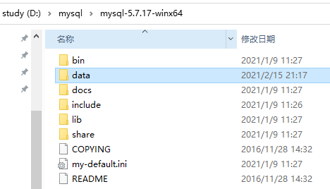
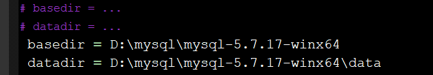
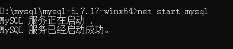
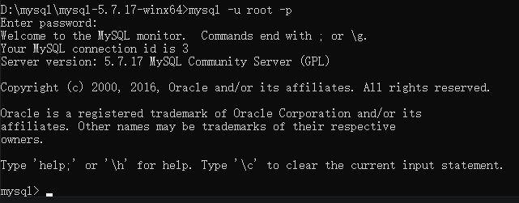
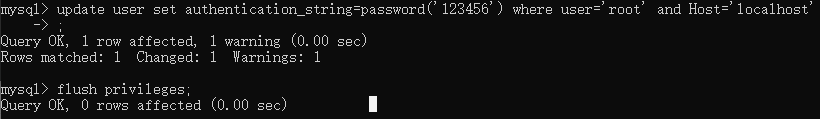

# mysql

MySQL5.7.17解压版详细安装教程

MySQL安装文件分为两种，**msi格式**和**zip格式**。

msi格式直接点击安装，按照它给出的安装提示进行安装

zip格式自己解压，解压缩之后其实MySQL就可以使用了，但是要进行配置

1. 将压缩包mysql-5.7.17-winx64.zip**解压到目标位置**。如：D盘。

2. 在解压文件夹中新建一个名为**data文件夹**



3. 打开**配置文件my-default.ini**
   - **basedir**：MySQL的安装（解压）路径
   - **datadir**：数据库文件（data）所在路径 
   - **去掉basedir和datadir前面#**



4. 配置环境变量，首先把bin的地址复制：打开**MySQL解压文件夹bin文件夹**，bin路径添加的Path变量值

   

   

6. 以**管理员身份**运行cmd），cmd进到MySQL解压目录下的bin文件(不管是否配置环境变量，也要进入bin文件夹，否则之后启动服务仍然会报错误)


7. 运行**mysqld命令进行初始化**。命令是：`mysqld --initialize-insecure --user=mysql`
   - `-initialize`：初始化
   - `-insecure`：生成空密码
   - `-user=mysql`：使用默认，默认账号root

8. 安装MySQL，`mysqld –install`

`mysqld –remove`：删除MySQL


9. 启动服务：`net start mysql`



停止服务： `net stop mysql`

> 用任务管理器 >> 服务 >> mysql >> 停止服务

**注意**：如果之前没有运行第7步命令：`mysqld --initialize-insecure --user=mysql` ，可能会造成服务不能启动。

> 先用命令mysqld –remove卸载mysql，再运行该命令

10. 服务启动成功之后，可以登录，如图，输入`mysql -u root -p`

    > 第一次登录没有密码，直接按回车过，登录成功

 

11. 修改密码

```shell
# 选择数据库
use mysql;
# 更新root
update user set authentication_string=password('新密码') where user='root' and Host='localhost';
# 刷新权限
flush privileges;
```



12.备份数据库

**备份**：mysql中**data文件夹**

**恢复**

- 暂停数据库：`net stop mysql`
- 将data文件夹中` ibdata1` 覆盖新的`ibdata1`
- **?** 删除 `ib_logfile0`，`ib_logfile1`

