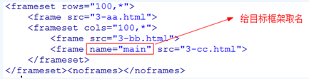
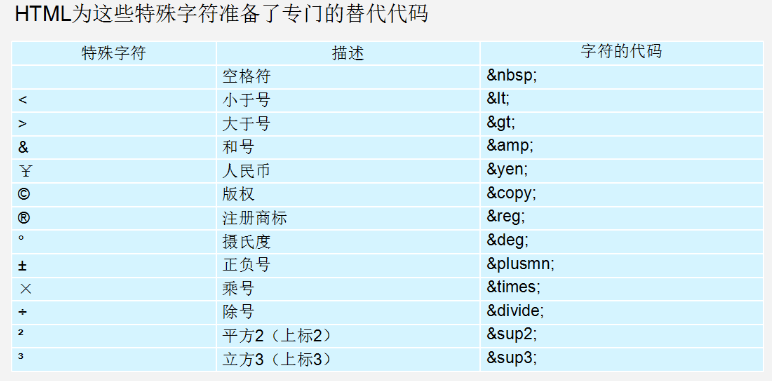

## 标签

### 分类

**双标签**：成对出现的标签，内容写在标签中间`<p>段落</p>`

**单标签**：单个的标签，没有内容只有属性`<hr>`

### 属性

每个标签都有属性，一个标签可以有多个属性

`<标签名 属性1="值1" 属性="值2"></标签名>`

#### 常用通用属性

| 属性                                                         | 描述                       |
| :----------------------------------------------------------- | :------------------------- |
| `class`                                                      | 元素的一个或多个**类名**   |
| `id`                                                         | 元素的***唯一* id**        |
| `style`                                                      | 元素的**行内 CSS 样式**    |
| [title](https://www.w3school.com.cn/tags/att_standard_title.asp) | 规定有关元素的**额外信息** |

#### 其他通用属性

| 属性                                                         | 描述                                           | 版本 |
| :----------------------------------------------------------- | :--------------------------------------------- | ---- |
| [accesskey](https://www.w3school.com.cn/tags/att_standard_accesskey.asp) | **激活元素的快捷键**                           |      |
| [dir](https://www.w3school.com.cn/tags/att_standard_dir.asp) | 元素中内容的**文本方向**                       |      |
| [lang](https://www.w3school.com.cn/tags/att_standard_lang.asp) | 元素内容的**语言**                             |      |
| [tabindex](https://www.w3school.com.cn/tags/att_standard_tabindex.asp) | 元素的 **tab 键次序**                          |      |
| [translate](https://www.w3school.com.cn/tags/att_global_translate.asp) | 规定**是否翻译**元素内容                       | h5   |
| [`contenteditable`](https://www.w3school.com.cn/tags/att_global_contenteditable.asp) | 规定元素**内容是否可编辑**                     | h5   |
| [contextmenu](https://www.w3school.com.cn/tags/att_global_contextmenu.asp) | 规定元素的**上下文菜单**                       | h5   |
| [`data-*`](https://www.w3school.com.cn/tags/att_global_data.asp) | 存储页面或应用程序的**私有定制数据**           | h5   |
| [`draggable`](https://www.w3school.com.cn/tags/att_global_draggable.asp) | 元素**是否可拖动**                             | h5   |
| [dropzone](https://www.w3school.com.cn/tags/att_global_dropzone.asp) | 在拖动被**拖动数据时是否进行复制、移动或链接** | h5   |
| [`hidden`](https://www.w3school.com.cn/tags/att_global_hidden.asp) | 元素仍未或不再相关                             | h5   |

*Tips*

`data-*` 属性

- 属性**名**：**不含大写字母**，并且在前缀 "data-" 之后必须有**至少一个字符**
- 属性**值**：可以是任意字符串

### 标题

一级标题：`<h1></h1>`
二级标题：`<h2></h2>`
...
六级标题：`<h6></h6>`

标题标签在*SEO搜索引擎中权重比较大*

>SEO：（Search Engine Optimization）：汉译为[搜索引擎](https://baike.baidu.com/item/%E6%90%9C%E7%B4%A2%E5%BC%95%E6%93%8E)优化

### 排版

**段落**：`<p></p>`
**水平线**：`<hr>`
**换行**：`<br>`

**预排版标签**

```html
<pre>
    									上
    左																右
    									下
</pre>
```

### 文本格式化标签

**粗体**：`<b>`
**斜体**：`<i>`
**下划线**：`<u>`

上标字：`<sub>`
下标字：`<sup>`
删除字：`<del>`

大号字：`<big>`
小号字：`<small>`

以下为强调标签，**强调标记`SEO`中权重更大**

**粗体**：`<strong>`
**斜体**：`<em>`
**下划线**：`<ins>`

### 计算机标签

| 标签   | 描述               |
| :----- | :----------------- |
| `code` | 定义计算机代码文本 |
| `kbd`  | 定义键盘文本       |
| `samp` | 定义计算机代码示例 |
| `var`  | 定义变量           |
| `pre`  | 定义预格式化文本   |

>  `<pre> <code> <var>`三者配合可以美化代码样式
>
>  `code`不会保留多余**空格** **折行**

### 引用、术语标签

**缩写**：`<abbr>` - *缩写或首字母缩略*

The <abbr title="People's Republic of China">PRC</abbr> was founded in 1949.

**地址**：`<address>` - *文章或作者联系信息*

<address>
Written by <a href="mailto:webmaster@example.com">Donald Duck</a>.<br> 
Visit us at:<br>
Example.com<br>
Box 564, Disneyland<br>
USA
</address>

**文字方向**：`<bdo>`

<bdo dir="rtl">
Here is some Hebrew text
</bdo>

**长引用**：`<blockquote>` - *缩进处理*

<blockquote cite="http://www.worldwildlife.org/who/index.html">
五十年来，WWF 一直致力于保护自然界的未来。
</blockquote>

短引用：`<q>` - *通常被引号包围*

<p>WWF 的目标是 <q>构建人与自然和谐相处的世界。</q></p>

引用标题：`<cite>` - *著作的标题*

<cite>The Scream</cite> by Edward Munch. Painted in 1893.

### 图像

#### img标签

向网页中嵌入一幅图像

| 属性                                                         | 值              | 描述                           |
| :----------------------------------------------------------- | :-------------- | :----------------------------- |
| `alt`    | text            | 图像的替代文本(图像无法载入时) |
| `src`    | URL             | 显示图像的 URL                 |
| `height` | `pixels` | `%`  |
| [ismap](https://www.w3school.com.cn/tags/att_img_ismap.asp) | URL             | 将图像定义为服务器端图像映射   |
| [longdesc](https://www.w3school.com.cn/tags/att_img_longdesc.asp) | URL             | 指向包含长的图像描述文档的 URL |
| [usemap](https://www.w3school.com.cn/tags/att_img_usemap.asp) | URL             | 将图像定义为客户器端图像映射   |
| `width` | *`pixels` |`%`* |

`ismap`：当点击一个服务器端图像映射时，*点击坐标*会以 URL 查询字符串的形式发送到服务器

>`` 元素属于带有有效 `href` 属性的 `<a>` 元素的后代，`ismap`才有效

`longdesc`：与`alt`类似，但可以显示更多文本。

> `alt`最多1024个字符

`usemap`：`usemap` 属性与 `<map>` 元素的 `name` 或 `id` 属性相关联，以建立 `` 与 `<map>` 之间的关系

`ismap` 和 `usemap` 差异

`usemap` 客户端处理图像映射，不要求有服务器或特殊的服务器软件

**应用**：在浏览一家全国范围的大公司网页时，用户可能会在地图上单击他们所居住的城市，以获得附近地区零售店的地址和电话号码等。

#### map标签

定义一个客户端图像映射。**图像映射**（image-map）指带有可点击区域的一幅图像。

| 属性                                                      | 值                    | 描述                      |
| :-------------------------------------------------------- | :-------------------- | :------------------------ |
| `id`                                                      | unique_name(**必选**) | 为 map 标签定义唯一的名称 |
| [name](https://www.w3school.com.cn/tags/att_map_name.asp) | mapname               | 为 image-map 规定的名称   |

#### area标签

*定义图像映射中的区域*

`area` 元素总是嵌套在 `<map>` 标签中。`img`标签 `usemap`与 `map`标签 `name`属性映射

> 映射 使用 name 还是 id取决于浏览器，所以两者都加上

| 属性                                                         | 值                     | 描述                                     |
| :----------------------------------------------------------- | :--------------------- | :--------------------------------------- |
| `alt`                                                        | text（**必选**）       | 定义此区域的替换文本                     |
| [`coords`](https://www.w3school.com.cn/tags/att_area_coords.asp) | 坐标值                 | 定义可点击区域（对鼠标敏感的区域）的坐标 |
| `href`                                                       | URL                    | 定义此区域的目标 URL                     |
| [nohref](https://www.w3school.com.cn/tags/att_area_nohref.asp) | nohref                 | 从图像映射排除某个区域                   |
| [shape](https://www.w3school.com.cn/tags/att_area_shape.asp) | defaultrectcircpoly    | 定义区域的形状                           |
| `target`                                                     | _blank_parent_self_top | 规定在何处打开 href 属性指定的           |

下列代码，点击图片不同区域，显示不同的内容。

```html


<map name="planetmap" id="planetmap">
  <area shape="circle" coords="180,139,14" href ="venus.html" alt="Venus" />
  <area shape="circle" coords="129,161,10" href ="mercur.html" alt="Mercury" />
  <area shape="rect" coords="0,0,110,260" href ="sun.html" alt="Sun" />
</map>
```

### 超链接

#### a

| 属性                                                    | 值                                            | 描述                                   |      |
| ------------------------------------------------------- | --------------------------------------------- | -------------------------------------- | ---- |
| `herf`                                                  | URL                                           | 链接指向**页面 URL**                   |      |
| [`rel`](https://www.w3school.com.cn/tags/att_a_rel.asp) | text                                          | 当前文档与**被链接文档**之间的**关系** |      |
| `target`                                                | `_blank | _parent | _self | _top | framename` | **何处**打开链接文档                   |      |
| `download`                                              | filename                                      | **被下载**的超链接**目标**             | h5   |
| `media`                                                 | media_query                                   | 被链接文档是为**何种媒介/设备**优化的  | h5   |
| `type`                                                  | MIME type                                     | 被链接文档的的 `MIME` 类型             | h5   |

#### download

下载图片，名称为 `w3logo.jpg`

```html
<a href="/images/myw3schoolimage.jpg" download="w3logo">
```

#### target

| 值          | 描述                           |
| :---------- | :----------------------------- |
| `_blank`    | 在**新窗口**中打开             |
| `_self`     | *默认*。在**相同框架**中打开。 |
| `_parent`   | 在**父框架集**中打开。         |
| `_top`      | 在**整个窗口**中打开。         |
| `framename` | 在**指定框架**中打开。         |

*链接分类*

- 内部链接：本地跳转 `href='index.html'`
- 外部链接：跳转到其他网站 `href='www.baidu.com'`
- 下载链接：跳转到浏览器无法打开的文件 `href='my.ppt'`
- **锚点链接**：跳转到指定锚点处 `href='#ss'` `<p id='ss'></p`

> p元素不能包含任何块级元素(包括自身)
>
> a元素可以包含任何其他元素(除了自身)

```html
<p>123<p>456</p></p>
<!-- 被浏览器解析 -->
<p>123</p>
<p>456</p>
```

### 表单

#### form

| 属性                                                         | 描述                                                         |
| ------------------------------------------------------------ | ------------------------------------------------------------ |
| [accept-charset](https://www.w3school.com.cn/tags/att_form_accept-charset.asp) | 服务器可处理的表单数据**字符集**                             |
| `action`                                                     | 提交表单时向**何处发送**表单数据 (*相对`url`*：站内文件。*绝对`url`*：其他站点) |
| `enctype`                                                    | 发送表单数据之前**如何对其进行编码**                         |
| [method](https://www.w3school.com.cn/tags/att_form_method.asp) | 发送 form-data 的 **`HTTP` 方法**（`get` 、`post`）          |
| name                                                         | 表单**名称**。提供一种引用                                   |
| [`novalidate`](https://www.w3school.com.cn/tags/att_form_novalidate.asp) | 使用属性，提交表单不进行验证。 *h5*                          |
| [rel](https://www.w3school.com.cn/tags/att_form_rel.asp)     | **链接资源**和**当前文档**的**关系**                         |
| `target`                                                     | 规定在何处。同 a标签                                         |
| `autocomplete`                                               | 规定是否启用表单的自动完成功能。*h5*                         |

##### novalidate 

适用于：`<form>`，以及以下类型的 <input> 标签：`text, search, url, telephone, email, password, date pickers, range , color`。

##### autocomplete

适用范围 同上

| 值    | 描述                 |
| :---- | :------------------- |
| `on`  | *默认*。启用自动完成 |
| `off` | 禁用自动完成         |

##### enctype

| 值                                  | 描述                                                         |
| :---------------------------------- | :----------------------------------------------------------- |
| `application/x-www-form-urlencoded` | 在发送前对所有字符**进行编码**（默认）。                     |
| `multipart/form-data`               | **不**对字符**编码**。当使用有文件上传控件的表单时，该值是必需的。 |
| `text/plain`                        | 将**空格转换为 "`+`" 符号**，但不编码特殊字符。              |

##### rel

| 值           | 描述                                                   |
| :----------- | :----------------------------------------------------- |
| `external`   | 引用文档**不是当前站点**的一部分                       |
| help         | 链接到帮助文档                                         |
| license      | 链接到文档的版权信息                                   |
| `next`       | 集合中**下一个**文档                                   |
| nofollow     | 链接到未经认可的文档，例如付费链接。                   |
| `noreferrer` | 用户点击该超链接，则浏览器**不应发送 `HTTP` 推荐标头** |
| `prev`       | 集合中的**上一个**文档。                               |
| search       | 链接到文档的搜索工具                                   |

#### input

| 属性                                                         | 描述                                                         | 注意                                                       | 兼容性 |
| :----------------------------------------------------------- | :----------------------------------------------------------- | ------ | ------------------------------------------------------------ |
| [accept](https://www.w3school.com.cn/tags/att_input_accept.asp) | 规定**上传文件的类型**                                     | `type="file"`，以后均简写 type |        |
| `value` | input 元素的值                                               | 不适用 `file`                     |        |
| alt    | 图像输入替代文本                                             |                                              |        |
| `checked` | **首次加载应被选中**                                         | `checkbox` `radio`                     |        |
| `disabled` | **禁用**元素                                                | 禁用后，不可用，不可点击。不适用 `hidden`                 |        |
| [maxlength](https://www.w3school.com.cn/tags/att_input_maxlength.asp) | 字符**最大数量**                                     |                                          |        |
| `readonly` | **只读**                                                     | `text`、`password`。tab可切换到字段，可选中拷贝文本    |        |
| size  | **可见**字符数                                | `text`、`password`                        |        |
| [src](https://www.w3school.com.cn/tags/att_input_src.asp)    | **提交按钮显示图像**URL                                      |                                      |        |
| width | 定义 input **宽度** | `image` | h5           |
| height | 定义 input **高度** | `image`，设置宽高后，加载时会**预留空间** | h5 |
| autocomplete | 输入字段**自动补全**                                         |                                                     | h5                               |
| [`autofocus`](https://www.w3school.com.cn/tags/att_input_autofocus.asp) | 加载时**是否获得焦点**         | 不适用 `hidden` | h5     |
| form  | 规定输入字段所属的一个或多个表单                           |                            | h5     |
| `formaction` | **覆盖**表单的 `action` 属性 | `submit` `image`                                    | h5     |
| `formenctype` | **覆盖**表单的 `enctype` 属性 | `submit` `image` | h5     |
| `formmethod` | **覆盖**表单的 `method` 属性 | `submit` `image` | h5     |
| `formnovalidate` | **覆盖**表单的 `novalidate` 属性 |  | h5     |
| `formtarget` | **覆盖**表单的 `target` 属性 | `submit` `image` | h5     |
| [list](https://www.w3school.com.cn/tags/att_input_list.asp)  | 输入字段的**预定义选项 `datalist`**             |                    | h5     |
| max    | 输入字段的**最大值**。 |  | h5     |
| min    | 输入字段的**最小值**。 |  | h5     |
| `multiple` | 输入字段**可选择多个值**            | `email` `file` | h5     |
| `name` | 定义 input 元素**名称**                                |                                       | h5     |
| `pattern` | 输入字段值的**模式或格式** |  | h5     |
| `placeholder` | 填写输入**字段提示**                |                              | h5     |
| `required` | 指示输入字段值是**必需**                               | `text, search, url, telephone, email, password, date pickers, number, checkbox, radio，file` | h5     |
| step  | 输入字的**合法数字间隔**                             | 用`max`、`min` | h5     |

##### type

| 值       | 描述                                               |
| :------- | :------------------------------------------------- |
| button   | **按钮**                                           |
| checkbox | **复选**框                                         |
| file     | **文件**上传                                       |
| `hidden` | **隐藏输入字段**                                   |
| image    | **图形**提交按钮                                   |
| password | **密码**                                           |
| radio    | **单选**                                           |
| reset    | **重置**按钮。重置按钮会**清除**表单中的所有数据。 |
| submit   | **提交**按钮。提交按钮会把表单数据**发送**到服务器 |
| text     | 输入文本                                           |

##### max,min

`max` 和 `min` 属性适用于以下 `<input>` 类型：`number, range, date, datetime, datetime-local, month, time 以及 week`。

```html
<input max="number|date">
```

##### name

对提交到服务器后的表单**数据进行标识**，设置了 `name` 属性的表单元素才能在提交表单时传递值

##### pattern

**模式**指的是**正则表达式**。`pattern` 属性适用于以下 `<input>` 类型：`text, search, url, telephone, email 以及 password` 

```html
<input type="text" name="country_code" pattern="[A-z]{3}"
  title="Three letter country code" />
```

##### placeholder

`placeholder` 属性适用于以下的 `<input>` 类型：`text, search, url, telephone, email 以及 password`。

### 表格

| 表格       | 描述                     |
| :--------- | :----------------------- |
| `table`    | 表格                     |
| `caption`  | 表格**标题**             |
| `tr`       | 表格**行**               |
| `th`       | 表格**表头**（表头信息） |
| `td`       | 表格**单元**（数据）     |
| `thead`    | 表格**页眉**             |
| `tbody`    | 表格**主体**             |
| `tfoot`    | 表格**页脚**             |
| `col`      | 表格**列属性**           |
| `colgroup` | 表格**列组**             |

#### table标签

| 属性                                                         | 描述                             |
| :----------------------------------------------------------- | :------------------------------- |
| `border`                                                     | **边框宽度**                     |
| `cellpadding`                                                | 单元格**内边距**                 |
| `cellspacing`                                                | 单元格**外边距**                 |
| [`frame`](https://www.w3school.com.cn/tags/att_table_frame.asp) | **外侧边框**显示（哪些方向显示） |
| [rules](https://www.w3school.com.cn/tags/att_table_rules.asp) | **内侧边框**显示（哪些方向显示） |
| `width`                                                      | 规定表格**宽度**                 |

#### caption标签

`caption` 标签必须紧随 `table` 标签。通常居中于表格之上（只能定义一个）

#### tr标签

`aligin` 和 `valign`，同下

#### th、td标签

| 属性                                                         | 描述                                            |
| :----------------------------------------------------------- | :---------------------------------------------- |
| `align`                                                      | 单元格内容**水平对齐方式**                      |
| [`colspan`](https://www.w3school.com.cn/tags/att_th_colspan.asp) | 单元格**可横跨列数**。值为0，横跨到最后一列     |
| `rowspan`                                                    | 规定单元格**可横跨行数**。值为0，横跨到最后一行 |
| [`valign`](https://www.w3school.com.cn/tags/att_th_valign.asp) | 单元格内容**垂直排列方式**                      |

##### aligin

| 值                      | 描述                                     |
| :---------------------- | :--------------------------------------- |
| `left / right / center` | 左（默认） / 右 / 居中对齐内容           |
| justify                 | 对行进行伸展，这样每行都可以有相等的长度 |
| char                    | 将内容对准指定字符。                     |

##### valigin

| 值             | 描述                           |
| :------------- | :----------------------------- |
| `top / bottom` | 内容进行**上 / 下** 对齐       |
| `middle`       | 内容进行**居中**对齐（默认值） |
| `baseline`     | 与基线对齐                     |

#### thead tbody tfoot 标签

`<thead> <tbody>  <tfoot>`内部必须拥有 `<tr>` 标签。三者均有，`algin` `valigin`属性

> **出现次序**：`thead、tfoot、tbody`

### 列表

#### 无序列表 

```html
<ul>
   <li type='circle'>空心圆</li>
   <li type='square'>正方形</li>
   <li type='disc'>实心圆-默认</li> 
</ul>
```

#### 有序列表

```html
<ol>
    <li type='A or a'>大小写英文字母(A,a)</li>
    <li type='I or i'>大小写罗马数字(I,i)</li>
    <li type='1'>阿拉伯数字-默认</li>
</ol>
```

#### 自定义列表

```html
<dl>
    <dt>标题</dt>
	<dd>标题的补充</dd>
</dl>
```

### 块级元素

块级元素：显示时，以**新行**来开始（和结束）

> eg ： `<h1>, <p>, <ul>, <table>`

### 内联元素

内联（行内）元素：显示时，**不会以新行**开始

> eg：`<b>, <td>, <a>, `

### js标签

| 标签       | 描述                                   |
| :--------- | :------------------------------------- |
| `script`   | 定义客户端脚本                         |
| `noscript` | 不支持客户端脚本的用户**定义替代内容** |

## 头部元素

| 标签     | 描述                                         |
| :------- | :------------------------------------------- |
| `head`   | 关于文档的信息                               |
| `title`  | 文档**标题**                                 |
| `base`   | 定义页面所有链接的**默认地址**或**默认目标** |
| `link`   | 定义**文档与外部资源之间关系**               |
| `meta`   | HTML 文档的**元数据**                        |
| `script` | 定义**客户端脚本**                           |
| `style`  | 定义文档**样式信息**                         |

### head标签

 `<head>` 放在文档开始，在 `<html>` 后，处于 `<body>` 标签或 `<frameset>` 标签之前。`<title>` 是 `head` 部分中**唯一必需**元素

### base标签

指定**基本 `URL`** 来解析所有的**相对 `URL`**。这其中包括 `<a>、、<link>、<form>` 标签中的 `URL`

```html
<head>
<base href="http://www.w3school.com.cn/i/" />
<base target="_blank" />
</head>
```

| 属性     | 值                                    | 描述                                         |
| :------- | :------------------------------------ | :------------------------------------------- |
| `href`   | *URL*                                 | 规定页面中所有相对链接的基准 URL（**必填**） |
| `target` | `_blank _parent _self _top framename` | 何处打开页面（可选）                         |

### link标签

| 属性                                                         | 描述                                             |
| :----------------------------------------------------------- | :----------------------------------------------- |
| `href`                                                       | 被链接**文档位置**                               |
| `hreflang`                                                   | 被链接**文档文本语言**                           |
| [media](https://www.w3school.com.cn/tags/att_link_media.asp) | 被链接文档将被**显示在什么设备**                 |
| [rel](https://www.w3school.com.cn/tags/att_link_rel.asp)     | 当前文档与被链接**文档之间关系**                 |
| type                                                         | 被链接**文档 `MIME` 类型**                       |
| [sizes](https://www.w3school.com.cn/tags/att_link_sizes.asp) | 被**链接资源的尺寸**。仅适用于 `rel="icon"` *h5* |

##### media

所有浏览器都支持值为 "`screen`"、"`print`" 以及 "`all`" 的 media 属性

#### meta标签

`<meta> `提供有关页面的元信息（meta-information），比如针对搜索引擎和更新频度的描述和关键词

> `<meta>`永远位于 `head` 元素内部

| 属性         | 描述                                           |
| :----------- | :--------------------------------------------- |
| `content`    | 定义与 `http-equiv` 或 `name` 属性相关的元信息 |
| `http-equiv` | **`content` 属性关联 **`HTTP` 头部             |
| `name`       | 把 `content` 属性关联到一个**名称**            |
| `scheme`     | 指定**翻译属性值方案**                         |

##### name 

 `author description keywords generator revised others`

```html
<meta name="keywords" content="HTML,ASP,PHP,SQL">
```

#### http-equiv

`http-equiv` ：指示服务器在发送实际的文档之前先在要传送给浏览器的 MIME 文档头部包含名称/值对

至少发送：`content-type:text/html`，告诉浏览器准备接受一个 `HTML` 文档

```html
<meta http-equiv="charset" content="iso-8859-1">
<meta http-equiv="expires" content="31 Dec 2008">

content-type: text/html
charset:iso-8859-1
expires:31 Dec 2008
```

### script标签

| 属性                                                         | 描述                                             |
| :----------------------------------------------------------- | :----------------------------------------------- |
| type                                                         | 脚本 `MIME` 类型                                 |
| [async](https://www.w3school.com.cn/tags/att_script_async.asp) | **异步执行**脚本（仅适用于外部脚本）             |
| charset                                                      | 外部脚本文件使用**字符编码**                     |
| [defer](https://www.w3school.com.cn/tags/att_script_defer.asp) | 规定**是否对脚本执行进行延迟**，直到页面加载为止 |
| src                                                          | 规定外部脚本文件的 URL                           |
| `xml:space`                                                  | 规定是否保留代码中的空白                         |

#### async

多种执行外部脚本的方法

-  `async="async"`：脚本相对于页面的其余**部分异步地执行**（当页面继续进行解析时，脚本将被执行）
- 不使用 `async` 且 `defer="defer"`：脚本将在**页面完成解析时**执行
- 均不使用：浏览器继续**解析页面之前**，立即读取并执行脚本

## H5语义元素

**语义元素**：清楚地向浏览器和开发者**描述其意义**

- 语义化标签主要针对**搜索引擎**
- 新标签可以使用**一次或者多次**
- 在 `IE9` 浏览器中，需要把语义化标签都转换为**块级元素**
- 语义化标签，在移动端支持比较友好

| 标签         | 内容                                               |
| ------------ | -------------------------------------------------- |
| `article`    | 定义文章。                                         |
| `aside`      | 定义页面内容以外的内容。                           |
| `details`    | 定义用户能够查看或隐藏的额外细节。                 |
| `figcaption` | 定义 <figure> 元素的标题。                         |
| `figure`     | 规定自包含内容，比如图示、图表、照片、代码清单等。 |
| `footer`     | 定义文档或节的页脚。                               |
| `header`     | 规定文档或节的页眉。                               |
| `main`       | 规定文档的主内容。                                 |
| `mark`       | 定义重要的或强调的文本。                           |
| `nav`        | 定义导航链接。                                     |
| `section`    | 定义文档中的节。                                   |
| `summary`    | 定义 `<details>` 元素的可见标题。                  |
| `time`       | 定义日期/时间。                                    |

## URL

**统一资源定位器**（URL）用于定位万维网上的文档（或其他数据）

```shell
scheme://host.domain:port/path/filename
```

- `scheme` - 定义因特网服务的类型。最常见的类型是 http
- `host` - 定义域主机（http 的默认主机是 www）
- `domain` - 定义因特网域名，比如 w3school.com.cn
- `:port` - 定义主机上的端口号（http 的默认端口号是 80）
- `path` - 定义服务器上的路径（省略，代表根目录）。
- `filename` - 定义文档/资源的名称

## 文件路径

| 路径                        | 描述                     |
| --------------------------- | ------------------------ |
| src=`"picture.jpg"`         | 当前路径下，文件         |
| src=`"images/picture.jpg"`  | 当前路径下，images下文件 |
| src=`"/images/picture.jpg"` | 根目录下，images下文件   |
| src=`"../picture.jpg"`      | 上级目录下，文件         |

## 框架

### 框架结构标签

`<frameset>`：框架集

- `rows`属性：设置框架分几行显示
- `cols`属性：用来设置框架分几列显示

> rows和cols尽量不要同时设置（因为不能及时辨别每个位置的页面）

`<frame>`：框架，`src`属性用来引入要显示的页面

> `frame`不能放在`body`中

`<noframes>`：标签是当浏览器不支持框架时显示

> 可以将body标签放到`<noframes></noframes>`标签中

*`frame` 和 `iframe` 区别*

- `frame`不能脱离`frameSet`单独使用，`iframe`可以
- `frame`的高度只能通过`frameSet`控制，`iframe`可以自己控制
- 同一个页面使用了两个以上的`iframe`，在IE中正常显示，在firefox只显示第一个；而 `frame` 均能正常显示

### 框架嵌套

```html
<frameset cols="25%,75%">
   <frame src="frame_a.htm">
   <frame src="frame_b.htm">
</frameset>
```

### 框架中跳转



### 内嵌框架

`<iframe>`：创建包含另外一个文档的内联（行内）框架

| 属性         | 描述                                                       |
| :----------- | :--------------------------------------------------------- |
| frameborder  | 框架**边框**                                               |
| height       | **高度**                                                   |
| longdesc     | **长描述**                                                 |
| marginheight | **顶部和底部边距**                                         |
| marginwidth  | **左右侧的边距**                                           |
| `name`       | iframe 的**名称**用于在 JavaScript 中引用元素              |
| `sandbox`    | 启用 <iframe> 内容的**额外限制**  *H5*                     |
| `scrolling`  | **滚动条**                                                 |
| seamless     | 像是文档一部分。**无边框、无滚动条**  *H5*                 |
| src          | 显示文档 **URL**。（相对URL：站内文件。绝对URL：其他站点） |
| `srcdoc`     | 显示的页面 **HTML 内容**  *H5*                             |
| width        | **宽度**                                                   |

#### sandbox

| 值                     | 描述                                               |
| :--------------------- | :------------------------------------------------- |
| `""`                   | 应用以下所有的限制。                               |
| `allow-same-origin`    | 允许 iframe **内容被视为同源**                     |
| `allow-top-navigation` | 允许 iframe 内容**从**包含文档**导航（加载）内容** |
| `allow-forms`          | 允许**表单提交**                                   |
| `allow-scripts`        | 允许**脚本执行**                                   |

#### scrolling

| 值     | 描述                                 |
| :----- | :----------------------------------- |
| `auto` | 在**需要情况**下出现滚动条（默认值） |
| `yes`  | **始终显示**滚动条                   |
| `no`   | **从不显示**滚动条                   |

#### srcdoc

值必需为有效HMTL语法

```html
<iframe srcdoc="<p>Hello world!</p>" src="demo_iframe_srcdoc.htm"></iframe>
```


## html5

### 新特性

#### 语法更简单

a) 头部声明

`<!doctype html>`

b) 简化了字符集声明

`<meta charset="utf-8">`

#### 语法更宽松

a) 可以省略结束符的标签

`li、dt、dd、p、optgroup、option、tr、td、th`

b) 可以完全省略的标签

`html、head、body`

#### 标签语义化


### input新增type

|    属性    |   说明    |
| :--------: | :-------: |
|   email    | email类型 |
|    date    | 日期类型  |
|    time    | 时间类型  |
|   month    |           |
|    week    |           |
| **number** | 数字类型  |
|    url     |  url类型  |
|    tel     | 手机号码  |
|   search   |  搜索框   |
|   color    |   颜色    |
|   range    |   滑块    |

### 多媒体标签

#### embed标签

h4，播放音频和视屏

```html
<embed src='文件' autostart='自动播放' loop='循环播放' hidden='控制面板是否隐藏'></embed>
```

参考：https://www.cnblogs.com/lgx5/p/5714494.html

#### audio标签

h5，播放音频


```html
<!-- 注意：在 chrome 浏览器中已经禁用了 autoplay 属性 -->
  <!-- <audio src="./media/snow.mp3" controls autoplay></audio> -->
  <!-- 因为不同浏览器支持不同的格式，所以我们采取的方案是这个音频准备多个文件 -->
  <audio controls>
    <source src="./media/snow.mp3" type="audio/mpeg" />
 </audio>
```

参考：https://www.cnblogs.com/linn/p/3408515.html

#### video标签

h5，播放视屏


```html
<body>
  <!-- <video src="./media/video.mp4" controls="controls"></video> -->
  <!-- 谷歌浏览器禁用了自动播放功能，如果想自动播放，需要添加 muted 属性 -->
  <video controls="controls" autoplay muted loop poster="./media/pig.jpg">
    <source src="./media/video.mp4" type="video/mp4">
    <source src="./media/video.ogg" type="video/ogg">
  </video>
</body>
```

# 补充

## 字符集和字符编码

#### 字符集

**ansi**：不同的国家和地区制定了不同的标准，由此产生了 GB2312、GBK、Big5、Shift_JIS 等各自的编码标准。这些使用 **1 至 4 个字节来代表一个字符的各种汉字延伸编码方式**，称为 ANSI 编码。在简体中文Windows操作系统中，ANSI 编码代表 GBK 编码；在日文Windows操作系统中，ANSI 编码代表 Shift_JIS 编码。 不同 ANSI 编码之间互不兼容，当信息在国际间交流时，无法将属于两种语言的文字，存储在同一段 ANSI 编码的文本中。

**Unicode**（统一码、万国码、单一码）是计算机科学领域里的一项业界标准，包括字符集、编码方案等。Unicode 是为了解决传统的字符编码方案的局限而产生的，它**为每种语言中的每个字符设定了统一并且唯一的二进制编码**，以满足跨语言、跨平台进行文本转换、处理的要求。

#### 字符编码

**UTF-8**（8-bit Unicode Transformation Format）是一种针对Unicode的可变长度字符编码，又称万国码，用在网页上**可以统一页面显示中文简体繁体及其它语言**（如英文，日文，韩文）。

**GB2312**是一个**简体中文字符集**，由6763个常用汉字和682个全角的非汉字字符组成。其中汉字根据使用的频率分为两级。一级汉字3755个，二级汉字3008个。

**GBK**即汉字内码扩展规范，K为扩展的汉语拼音中“扩”字的声母。英文全称Chinese Internal Code Specification。**GBK编码标准兼容GB2312**，共收录汉字21003个、符号883个，并提供1894个造字码位，简、繁体字融于一库。

**Big5**又称为大五码或五大码，**繁体中文（正体中文）字符集标准**，共收录13,060个汉字。虽普及于香港、台湾、澳门等繁体中文通行区

### 实体




## 路径

#### 相对路径

当前目录： `./ ` 可省略
上级目录：`../`

#### 绝对路径

以盘符开头 `C:\index.html`


## 置换元素

浏览器根据元素的标签和属性，来决定元素的具体显示内容。 `<input>`标type属性来决定是显示输入框，还是单选按钮

根据标签的src属性的值来读取图片信息并显示出来，而如果查看html代码，则看不到图片的实际内容

`、<input>、<textarea>、<select>、<object> `都是置换元素。这些元素往往没有实际的内容，即是一个空元素

置换元素在其显示中生成了框，这也就是有的内联元素能够设置宽高的原因

## 不可替换元素

大多数元素是不可替换元素，即其内容直接表现给用户端（如浏览器）

 <label>label中的内容</label> 标签<label>是一个非置换元素，文字label中的内容将全被显示

## 空元素

一个**空元素（empty element）**可能是 HTML，SVG，或者 MathML 里的一个不能存在子节点（例如内嵌的元素或者元素内的文本）的[element](https://developer.mozilla.org/zh-CN/docs/Glossary/元素)。

在 HTML 中，通常在一个空元素上使用一个闭标签是无效的。例如， `<input type="text"></input>` 的闭标签是无效的 HTML。

```html
<area>
<base>
<br>
<col>
<colgroup> when the span is present
<command>
<embed>
<hr>

<input>
<keygen>
<link>
<meta>
<param>
<source>
<track>
<wbr>
```

